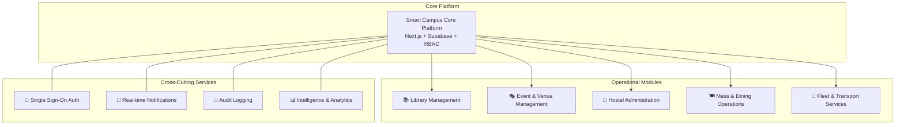
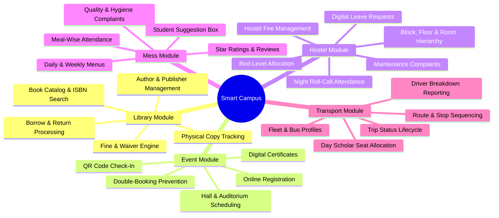
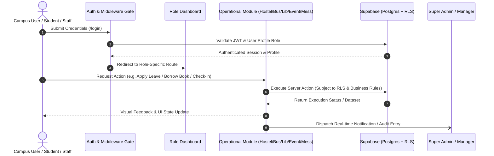

# 01. Project Overview

## 1. Executive Summary

The **Smart Campus Management System (SCMS)** is an integrated, cloud-ready enterprise web platform engineered to modernize, streamline, and centralize day-to-day collegiate operations. Higher education institutions traditionally struggle with fragmented legacy software, disconnected spreadsheets, physical paper logs, and communication silos across student services. 

SCMS unifies campus life into a single, cohesive digital ecosystem connecting students, faculty members, departmental administrators, and operational staff through modern role-based portals and real-time data synchronization.

---

## 2. Core Purpose & Mission

The primary mission of the Smart Campus Management System is to deliver **"One Campus, One Platform"**:

1. **Eliminate Operational Silos**: Replace disparate third-party tools with an integrated management interface.
2. **Elevate Student & Staff Experience**: Provide self-service digital workflows for book reservations, event tickets, hostel leaves, mess ratings, and transport tracking.
3. **Enforce Policy & Governance**: Implement granular Role-Based Access Control (RBAC) and edge security to maintain data privacy and strict organizational compliance.
4. **Data-Driven Administration**: Furnish campus leadership with real-time KPI metrics, exportable audit reports, and utilization trends.

---

## 3. Key Challenges & Problems Solved

| Traditional Campus Challenge                            | SCMS Solution                                                                                                                                                        |
| ------------------------------------------------------- | -------------------------------------------------------------------------------------------------------------------------------------------------------------------- |
| **Manual Paper-Based Hostel Leaves & Gate Passes**      | Digital leave application workflow with multi-status tracking (Pending, Approved, Rejected), warden remarks, and automatic attendance synchronization.               |
| **Long Library Queues & Untracked Overdue Fines**       | Centralized catalog search, automated borrow records with due date tracking, fine calculation (₹2/day), renewal limits, and one-click fine waivers.                  |
| **Chaotic Event Registration & Unverified Attendance**  | Online event discovery, instant digital QR pass generation, live mobile-friendly ticket scanning, and automatic attendance certificate issuance.                     |
| **Food Wastage & Unaddressed Mess Grievances**          | Published weekly meal schedules (Breakfast, Lunch, Snacks, Dinner), daily meal attendance logs, star ratings, categorized complaints, and actionable feedback loops. |
| **Disorganized Fleet Management & Stop Inefficiencies** | Configurable bus routes with stop sequencing, driver route assignments, trip status reporting, breakdown logging, and Day Scholar allocation.                        |
| **Unauthorized Access & Lack of Accountability**        | Edge-level route protection, database Row Level Security (RLS) policies, and immutable system audit logging for sensitive actions.                                   |

---

## 4. Major Operational Modules

The platform is structured into five dedicated operational pillars supported by centralized administrative utilities:

### 4.1. Library Management
A full-lifecycle library automation suite enabling catalog exploration, inventory categorization, physical copy barcode tracking, automated loan duration enforcement (14 days), fine calculation, renewals (max 2), and catalog analytics.

### 4.2. Event & Hall Management
A comprehensive campus event coordination engine featuring campus hall scheduling with automated conflict detection, digital registrations, ticket pass generation with dynamic QR verification, and digital certificate distribution.

### 4.3. Hostel Administration
An accommodation management system organizing blocks, floors, and rooms with bed-level occupancy tracking. Supports student room allocations, multi-day leave approval workflows, night roll-call attendance logs, fee tracking, and room maintenance tickets.

### 4.4. Mess & Dining Management
A nutritional and dining operations system publishing scheduled 4-slot daily menus (Breakfast, Lunch, Snacks, Dinner). Gathers student satisfaction ratings (1-5 stars), captures meal attendance, and manages kitchen complaints and menu suggestions.

### 4.5. Bus & Fleet Transport
A campus logistics system managing vehicle fleets, driver assignments, route paths, ordered stop waypoints, and student bus pass allocations with dedicated driver trip status management and breakdown incident reporting.

### 4.6. Central Administration & Governance
An overarching control module for Super Administrators providing user account management, role assignment, system-wide analytics, and audit log inspection.

---

## 5. End-to-End System Workflow

---

## 6. Technology Stack & Architectural Decisions

The solution leverages an industry-standard modern technology stack built for performance, security, and developer ergonomics:

| Layer / Concern        | Technology Used                         | Strategic Rationale                                                                                                                                  |
| ---------------------- | --------------------------------------- | ---------------------------------------------------------------------------------------------------------------------------------------------------- |
| **Frontend Framework** | **Next.js 15 (App Router)**             | Server Components provide fast initial page loads, optimal SEO, zero-bundle overhead for static elements, and streamlined Server Actions.            |
| **UI & Styling**       | **Tailwind CSS + Radix UI (shadcn/ui)** | Accessible, headless primitives styled with modern design tokens, responsive typography, polished dark/light contrasts, and smooth micro-animations. |
| **Icons & Visuals**    | **Lucide React**                        | Consistent, lightweight vector icon library representing all operational domains.                                                                    |
| **Backend & Database** | **Supabase (Managed PostgreSQL)**       | Enterprise relational database with Row Level Security (RLS), ACID transactions, UUID primary keys, and trigger-driven audit logging.                |
| **Authentication**     | **Supabase Auth + SSR**                 | Secure HTTP-only cookie session handling, JWT validation, edge-compatible authentication checks, and role metadata verification.                     |
| **Schema Validation**  | **Zod**                                 | Type-safe runtime schema validation for server actions and client forms, guaranteeing strict contract compliance.                                    |
| **Date Manipulation**  | **date-fns**                            | Modular, lightweight date computation for due date projections, renewal calculations, and timetable formatting.                                      |
| **Export Engines**     | **Client-Side CSV & Printable Reports** | Immediate, zero-latency export of tabular records (Hostel, Transport, Library, Events) without server rendering overhead.                            |

---

## 7. Strategic Technology Justifications

1. **Why Next.js Server Actions over REST Endpoints?**
   - Eliminates boilerplate API route maintenance while maintaining direct type safety between frontend forms and backend database queries.
   - Enforces execution within secure server environments where sensitive environment variables and service credentials remain protected.

2. **Why Supabase Row Level Security (RLS)?**
   - Defense-in-depth: Even if a malicious request bypasses frontend validation, the database engine itself enforces record-level access restrictions based on the caller's JWT identity and profile role.

3. **Why Edge Middleware Route Guards?**
   - Intercepts unauthorized navigation requests at the closest edge server before Next.js renders layout trees, saving server computing resources and preventing UI layout flash.

---

> [!NOTE]
> For environment configuration, database seeding, and installation instructions, refer to [`02-getting-started.md`](file:///f:/Project/SMART%20CAMPUS%20MANAGEMENT%20SYSTEM/SMART-CAMPUS-MANAGEMENT-SYSTEM/my-app/docs/02-getting-started.md).
