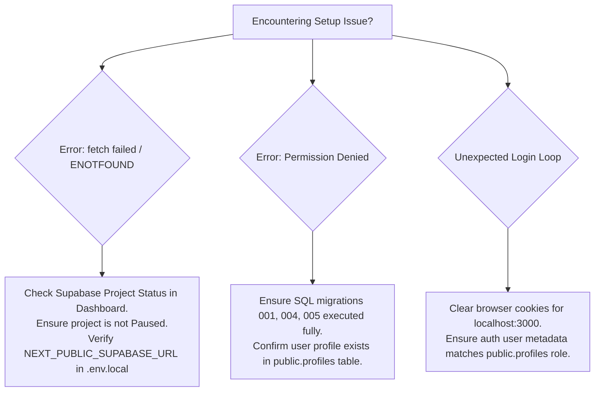

# 02. Getting Started & Installation Guide

This guide provides step-by-step instructions for provisioning, configuring, building, running, and deploying the **Smart Campus Management System (SCMS)**.

---

## 1. System Requirements

Before beginning the installation, ensure your environment meets the following specifications:

| Requirement               | Minimum Supported                  | Recommended                                  |
| ------------------------- | ---------------------------------- | -------------------------------------------- |
| **Node.js**               | `v18.17.0` (LTS)                   | `v20.x` or `v22.x`                           |
| **Package Manager**       | `npm v9.x`                         | `npm v10+` / `pnpm v8+`                      |
| **Database Engine**       | Supabase Cloud / Self-hosted       | PostgreSQL 15+ (with `uuid-ossp`, `pg_trgm`) |
| **Browser Compatibility** | Modern Chromium / Firefox / Safari | Latest Google Chrome / Edge / Firefox        |
| **Operating System**      | Windows 10/11, macOS, Linux        | Any modern 64-bit OS                         |

---

## 2. Project Installation

Clone the repository and install the project dependencies:

```bash
# 1. Navigate to the application directory
cd my-app

# 2. Install all required dependencies
npm install
```

---

## 3. Environment Variable Configuration

The system requires specific environment variables for database connectivity, authentication handling, and callback URL resolution.

1. Create a local environment configuration file named `.env.local` inside the `my-app` directory:

```bash
cp .env.example .env.local
```

2. Populate `.env.local` with your credentials:

```env
# ==============================================================
# SMART CAMPUS MANAGEMENT SYSTEM — Environment Variables
# ==============================================================

# Supabase Project URL (Publicly accessible)
NEXT_PUBLIC_SUPABASE_URL=https://<your-project-id>.supabase.co

# Supabase Anon/Public Key (Browser-safe)
NEXT_PUBLIC_SUPABASE_ANON_KEY=eyJhbGciOi...

# Supabase Service Role Key (⚠️ STRICTLY Server-side only)
# Used by server actions, administrative tasks, and seed scripts
SUPABASE_SERVICE_ROLE_KEY=eyJhbGciOi...

# Base Application URL (Used for authentication redirects & password resets)
NEXT_PUBLIC_APP_URL=http://localhost:3000

# Application Branding Name
NEXT_PUBLIC_APP_NAME=Smart Campus Management System
```

> [!WARNING]
> **Security Notice:** The `SUPABASE_SERVICE_ROLE_KEY` bypasses all Row Level Security (RLS) policies. Never expose this key in client-side code, Git commits, or public repositories.

---

## 4. Supabase Database Setup & Migrations

To initialize the database schema, extensions, and tables:

### Step 4.1: Execute Schema Migrations
1. Log in to your **[Supabase Dashboard](https://supabase.com/dashboard)**.
2. Select your target project and open the **SQL Editor**.
3. Execute the SQL scripts in sequential order from `my-app/supabase/migrations/`:
   - `001_initial_schema.sql` (Core tables, RLS policies, triggers, and indices)
   - `004_event_halls_and_seed.sql` (Event halls, venue booking, and category data)
   - `005_library_enhancements.sql` (Book languages, fine waiver status, and borrow policies)

### Step 4.2: Run the Automated Seed Script
The project includes a comprehensive data seeder that creates test accounts for all 8 campus roles along with pre-populated library books, hostel rooms, bus routes, mess menus, and event schedules.

```bash
# Run the master seed script from the my-app folder
node scripts/seed.mjs
```

---

## 5. Running the Application Locally

### 5.1. Development Mode
Start the local development server with hot-module reloading:

```bash
npm run dev
```
Open your browser and navigate to: **`http://localhost:3000`**

### 5.2. Production Build & Test
To validate the build locally before cloud deployment:

```bash
# Create the optimized production bundle
npm run build

# Start the production Next.js server
npm start
```

---

## 6. First Login & Default Credentials

After running the database seed script, you can log in immediately using any of the master test credentials:

| Role Title                | Email Address               | Password          | Landing Dashboard            |
| ------------------------- | --------------------------- | ----------------- | ---------------------------- |
| **Super Admin**           | `admin@smartcampus.com`     | `Admin@12345`     | `/admin/dashboard`           |
| **Hostel Warden**         | `warden@smartcampus.com`    | `Warden@12345`    | `/warden/dashboard`          |
| **Mess Manager**          | `mess@smartcampus.com`      | `Mess@12345`      | `/mess-manager/dashboard`    |
| **Librarian**             | `librarian@smartcampus.com` | `Librarian@12345` | `/librarian/dashboard`       |
| **Event Organizer**       | `organizer@smartcampus.com` | `Organizer@12345` | `/event-organizer/dashboard` |
| **Bus Driver**            | `driver@smartcampus.com`    | `Driver@12345`    | `/driver/dashboard`          |
| **Faculty Member**        | `faculty@smartcampus.com`   | `Faculty@12345`   | `/faculty/dashboard`         |
| **Student (Hosteller)**   | `student@smartcampus.com`   | `Student@12345`   | `/dashboard`                 |
| **Student (Day Scholar)** | `student11@smartcampus.com` | `Student11@12345` | `/dashboard`                 |

---

## 7. Cloud Deployment (Vercel)

The application is fully optimized for one-click deployment on **Vercel**:

1. Push your repository to GitHub / GitLab / Bitbucket.
2. In the **Vercel Dashboard**, click **Add New Project** and import the repository.
3. In the **Root Directory** field, select `my-app` (if deploying from a multi-directory repo).
4. Configure Environment Variables in Vercel Project Settings:
   - `NEXT_PUBLIC_SUPABASE_URL`
   - `NEXT_PUBLIC_SUPABASE_ANON_KEY`
   - `SUPABASE_SERVICE_ROLE_KEY`
   - `NEXT_PUBLIC_APP_URL` (Set to your production domain, e.g. `https://smartcampus.vercel.app`)
5. Click **Deploy**. Vercel will build and publish your instance with global Edge CDN caching and automated SSL.

---

## 8. Troubleshooting & Common Setup Notes



> [!TIP]
> **Port Conflicts:** If port 3000 is occupied, you can launch on an alternate port using: `npx next dev -p 3005`.
