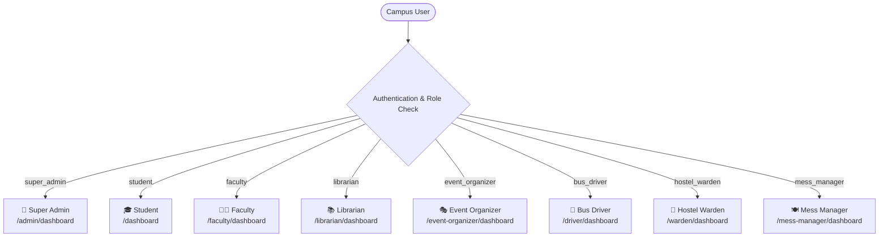

# 03. User Roles & Access Control Matrix

The **Smart Campus Management System (SCMS)** incorporates a rigorous, multi-tiered **Role-Based Access Control (RBAC)** architecture. Every user in the system is assigned exactly one primary role, which governs sidebar navigation, accessible routes, available UI actions, and database-level security policies.

---

## 1. Master Role Access & Capabilities Overview

| Role | Dashboard | Modules Accessible | Create | Read | Update | Delete | Special Permissions |
|:---|:---|:---|:---:|:---:|:---:|:---:|:---|
| **Super Admin** | `/admin/dashboard` | All Modules (Full Master Access) | ✓ | ✓ | ✓ | ✓ | System Audit, User Management, Master Config |
| **Student (Hosteller)** | `/dashboard` | Library, Events, Hostel, Mess, Profile | ✓ | ✓ | ✓ | ✓ | Leave Pass Application, Meal Ratings |
| **Student (Day Scholar)** | `/dashboard` | Library, Events, My Bus, Profile | ✓ | ✓ | ✓ | ✓ | Online Book Renewal, Event Passes |
| **Faculty Member** | `/faculty/dashboard` | Events, Certificates, Library, Profile | ✓ | ✓ | ✓ | ✓ | Event Attendance, Certificate Access |
| **Librarian** | `/librarian/dashboard` | Library, Catalog, Copies, Borrows, Fines | ✓ | ✓ | ✓ | ✓ | Book Issue/Return, Fine Waivers |
| **Event Organizer** | `/event-organizer/dashboard` | Events, Event Manager, QR Check-In, Analytics | ✓ | ✓ | ✓ | ✓ | Live QR Ticket Validation |
| **Hostel Warden** | `/warden/dashboard` | Hostel, Rooms, Allocations, Leaves, Fees | ✓ | ✓ | ✓ | ✓ | Leave Review/Approval, Night Roll-Call |
| **Mess Manager** | `/mess-manager/dashboard` | Mess, Weekly Menu, Attendance, Feedback | ✓ | ✓ | ✓ | ✓ | Weekly Menu Publishing, Feedback Audit |
| **Bus Driver** | `/driver/dashboard` | My Trips, Route Stops, Breakdown Reports | ✓ | ✓ | ✓ | — | Live Trip Lifecycle Controls (Start/End) |

---

## 2. Role Definitions & Responsibilities

---

### 2.1. Super Admin (`super_admin`)
- **Purpose**: System-wide supervisor with unrestricted operational authority over all campus services, master records, system configurations, and user profiles.
- **Default Dashboard**: [`/admin/dashboard`](file:///f:/Project/SMART%20CAMPUS%20MANAGEMENT%20SYSTEM/SMART-CAMPUS-MANAGEMENT-SYSTEM/my-app/app/(dashboard)/admin/dashboard/page.tsx)
- **Accessible Modules**: User Management, Audit Logs, Event Halls, Library, Events, Bus Management, Hostel Management, Mess Management.
- **Permissions**:
  - **View**: All system data, system metrics, users, audit logs, and module records.
  - **Create**: Users, event halls, buses, routes, bus stops, hostel structures, fee records, books, categories.
  - **Update**: Any user account, role assignments, route configurations, hall facilities, allocations.
  - **Delete**: Users, event halls, bus routes, books, hostel structures.
  - **Approve/Reject**: Can perform or override approvals across all operational modules.
  - **Export**: Full CSV and tabular data export across all modules.
- **Restricted Modules**: None (Unrestricted).

---

### 2.2. Student (`student`)
- **Purpose**: Undergraduate/postgraduate campus learners who consume educational and residential services.
- **Student Types**:
  - `HOSTELLER`: Resides on campus; has access to **Hostel** and **Mess** modules; **Bus** module is hidden.
  - `DAY_SCHOLAR`: Commutes daily; has access to **My Bus** route details; **Hostel** and **Mess** modules are hidden.
- **Default Dashboard**: [`/dashboard`](file:///f:/Project/SMART%20CAMPUS%20MANAGEMENT%20SYSTEM/SMART-CAMPUS-MANAGEMENT-SYSTEM/my-app/app/(dashboard)/dashboard/page.tsx)
- **Accessible Modules**: Library (catalog & personal borrows), Events (browsing & tickets), Profile, Notifications, plus Hostel/Mess (Hostellers) or Bus (Day Scholars).
- **Permissions**:
  - **View**: Book catalog, personal borrows/fines, public events, own tickets, assigned bus route (Day Scholars), room allocation/mess menu (Hostellers).
  - **Create**: Event registrations, book renewal requests, hostel leave requests, hostel/mess complaints, mess feedback ratings, suggestions.
  - **Update**: Own profile details (phone, avatar, address), password.
  - **Delete**: Cancel own event registrations, cancel own pending leave requests.
  - **Approve/Reject**: None.
  - **Export**: Personal event passes/tickets (printable/QR).
- **Restricted Modules**: Admin dashboards, staff management tools, hall scheduling, bus driver consoles.

---

### 2.3. Faculty (`faculty`)
- **Purpose**: Teaching staff and academic faculty participating in institutional events, academic workshops, and campus programs.
- **Default Dashboard**: [`/faculty/dashboard`](file:///f:/Project/SMART%20CAMPUS%20MANAGEMENT%20SYSTEM/SMART-CAMPUS-MANAGEMENT-SYSTEM/my-app/app/(dashboard)/faculty/dashboard/page.tsx)
- **Accessible Modules**: Events, Event Certificates, Library, Profile, Notifications.
- **Permissions**:
  - **View**: Academic and institutional events, personal registrations, earned participation certificates, library catalog.
  - **Create**: Event registrations for faculty-eligible events.
  - **Update**: Own profile details, password.
  - **Delete**: Unregister from upcoming events.
  - **Approve/Reject**: None.
  - **Export**: Digital participation certificates.
- **Restricted Modules**: User administration, hostel/mess/bus operational management.

---

### 2.4. Librarian (`librarian`)
- **Purpose**: Central library staff responsible for managing bibliographic records, physical book copies, issuance, returns, overdue fines, and inventory health.
- **Default Dashboard**: [`/librarian/dashboard`](file:///f:/Project/SMART%20CAMPUS%20MANAGEMENT%20SYSTEM/SMART-CAMPUS-MANAGEMENT-SYSTEM/my-app/app/(dashboard)/librarian/dashboard/page.tsx)
- **Accessible Modules**: Library Catalog, Authors, Categories, Publishers, Physical Copies, Borrow & Return Terminal, Fines & Waivers, Library Analytics.
- **Permissions**:
  - **View**: Complete bibliographic catalog, borrow histories, overdue reports, fine ledgers, and inventory stats.
  - **Create**: Books, authors, categories, publishers, physical copy records, borrow transactions.
  - **Update**: Book details, copy status (available, maintenance, damaged, lost), borrow due dates, renewal extensions.
  - **Delete**: Books without active loans, authors, categories, unused publishers.
  - **Approve/Reject**: Fine waiver authorizations (Waive / Pay).
  - **Export**: Catalog reports, fine collections, and active borrow lists.
- **Restricted Modules**: Admin user settings, bus fleet, hostel blocks, mess catering.

---

### 2.5. Event Organizer (`event_organizer`)
- **Purpose**: Campus activity directors, cultural secretaries, and departmental heads organizing workshops, seminars, competitions, and conferences.
- **Default Dashboard**: [`/event-organizer/dashboard`](file:///f:/Project/SMART%20CAMPUS%20MANAGEMENT%20SYSTEM/SMART-CAMPUS-MANAGEMENT-SYSTEM/my-app/app/(dashboard)/event-organizer/dashboard/page.tsx)
- **Accessible Modules**: Events Directory, Event Manager, QR Check-In Terminal, Event Analytics.
- **Permissions**:
  - **View**: All campus events, venue schedules, participant rosters, real-time check-in stats.
  - **Create**: Campus events, venue booking requests.
  - **Update**: Event details (time, venue, capacity, description, banner), event lifecycle status (`draft`, `upcoming`, `ongoing`, `completed`, `cancelled`).
  - **Delete**: Draft or cancelled events created by self.
  - **Approve/Reject / Validate**: Real-time QR ticket verification and live attendance check-in.
  - **Export**: Registered participant rosters, attendance CSV records.
- **Restricted Modules**: Hall infrastructure creation (Super Admin only), hostel management, bus dispatch.

---

### 2.6. Bus Driver (`bus_driver`)
- **Purpose**: Campus transport drivers responsible for operating scheduled bus trips, updating live transit progress, and reporting vehicle maintenance issues.
- **Default Dashboard**: [`/driver/dashboard`](file:///f:/Project/SMART%20CAMPUS%20MANAGEMENT%20SYSTEM/SMART-CAMPUS-MANAGEMENT-SYSTEM/my-app/app/(dashboard)/driver/dashboard/page.tsx)
- **Accessible Modules**: Driver Dashboard, Trip Controller, Vehicle Maintenance/Breakdown Reporting.
- **Permissions**:
  - **View**: Assigned bus information, assigned route waypoints, ordered stops, pickup timings, and student passenger lists.
  - **Create**: Breakdown & maintenance complaint tickets.
  - **Update**: Trip status (`scheduled` ➔ `in_progress` ➔ `completed` / `cancelled`), trip delay notes.
  - **Delete**: None.
  - **Approve/Reject**: None.
  - **Export**: None.
- **Restricted Modules**: Route creation, student bus pass allocation (Admin only), library, hostel, mess.

---

### 2.7. Hostel Warden (`hostel_warden`)
- **Purpose**: Residential administrators overseeing hostel infrastructure, student room and bed allocations, night attendance roll-calls, student leave requests, and facility maintenance.
- **Default Dashboard**: [`/warden/dashboard`](file:///f:/Project/SMART%20CAMPUS%20MANAGEMENT%20SYSTEM/SMART-CAMPUS-MANAGEMENT-SYSTEM/my-app/app/(dashboard)/warden/dashboard/page.tsx)
- **Accessible Modules**: Hostel Overview, Rooms & Beds, Student Allocations, Leave Requests, Night Attendance, Maintenance Complaints, Hostel Fees, Hostel Analytics.
- **Permissions**:
  - **View**: Hostel buildings, floor layouts, room bed occupancies, student resident profiles, fee ledgers, leave logs.
  - **Create**: Room allocation assignments, fee records, attendance roll-calls.
  - **Update**: Bed occupancy status, room condition, complaint resolution status (`open` ➔ `in_progress` ➔ `resolved` ➔ `closed`), fee payment status.
  - **Delete**: Deallocate student from bed (move-out).
  - **Approve/Reject**: Approve or reject student leave passes with mandatory rejection remarks.
  - **Export**: Resident student lists, room occupancy matrices, fee collection reports.
- **Restricted Modules**: Bus fleet routing, library fines, event hall infrastructure.

---

### 2.8. Mess Manager (`mess_manager`)
- **Purpose**: Campus food services and catering supervisor managing weekly nutrition plans, meal attendance, kitchen hygiene, and student culinary feedback.
- **Default Dashboard**: [`/mess-manager/dashboard`](file:///f:/Project/SMART%20CAMPUS%20MANAGEMENT%20SYSTEM/SMART-CAMPUS-MANAGEMENT-SYSTEM/my-app/app/(dashboard)/mess-manager/dashboard/page.tsx)
- **Accessible Modules**: Mess Overview, Weekly Menu Planner, Meal Attendance, Student Feedback & Ratings, Mess Complaints, Menu Suggestions, Mess Analytics.
- **Permissions**:
  - **View**: Daily/weekly meal plans, meal headcounts, star ratings, categorized food complaints, suggestions, dining analytics.
  - **Create**: Daily meal menus for 4 meal windows (Breakfast, Lunch, Snacks, Dinner), record manual meal attendance.
  - **Update**: Menu food items, complaint resolution statuses (`open` ➔ `in_progress` ➔ `resolved`), suggestion review states.
  - **Delete**: Remove unserved future menu plans.
  - **Approve/Reject**: Accept / implement student menu suggestions.
  - **Export**: Meal attendance reports, student satisfaction audit summaries.
  - **Restricted Modules**: Hostel bed allocation, library circulation, bus logistics.

---

## 3. Comprehensive Master Permission Matrix

| Operational Action | Super Admin | Student (Hosteller) | Student (Day Scholar) | Faculty | Librarian | Event Organizer | Hostel Warden | Mess Manager | Bus Driver |
|:---|:---:|:---:|:---:|:---:|:---:|:---:|:---:|:---:|:---:|
| **Manage Users & Roles** | ✓ | — | — | — | — | — | — | — | — |
| **View Audit Logs** | ✓ | — | — | — | — | — | — | — | — |
| **Create Event Venues / Halls** | ✓ | — | — | — | — | — | — | — | — |
| **Create & Edit Events** | ✓ | — | — | — | — | ✓ | — | — | — |
| **Register for Events** | ✓ | ✓ | ✓ | ✓ | ✓ | ✓ | ✓ | ✓ | ✓ |
| **QR Check-in & Validate Ticket** | ✓ | — | — | — | — | ✓ | — | — | — |
| **Manage Books & Physical Copies** | ✓ | — | — | — | ✓ | — | — | — | — |
| **Issue & Return Books** | ✓ | — | — | — | ✓ | — | — | — | — |
| **Waive Library Fines** | ✓ | — | — | — | ✓ | — | — | — | — |
| **Renew Borrowed Books** | ✓ | ✓ (Self) | ✓ (Self) | ✓ (Self) | ✓ | — | — | — | — |
| **Allocate Hostel Beds** | ✓ | — | — | — | — | — | ✓ | — | — |
| **Apply for Hostel Leave** | — | ✓ | — | — | — | — | — | — | — |
| **Approve / Reject Leave Passes** | ✓ | — | — | — | — | — | ✓ | — | — |
| **Publish Weekly Mess Menu** | ✓ | — | — | — | — | — | — | ✓ | — |
| **Submit Meal Feedback & Rating** | — | ✓ | — | — | — | — | — | — | — |
| **Configure Bus Routes & Stops** | ✓ | — | — | — | — | — | — | — | — |
| **Assign Student Bus Passes** | ✓ | — | — | — | — | — | — | — | — |
| **Start / Complete Bus Trips** | ✓ | — | — | — | — | — | — | — | ✓ |
| **Report Bus Breakdown Ticket** | ✓ | — | — | — | — | — | — | — | ✓ |
| **Export Module Data (CSV/Print)** | ✓ | — | — | — | ✓ | ✓ | ✓ | ✓ | — |

---

> [!NOTE]
> Detailed technical mechanics of how route guards and session tokens protect these boundaries are documented in [`04-authentication-and-security.md`](file:///f:/Project/SMART%20CAMPUS%20MANAGEMENT%20SYSTEM/SMART-CAMPUS-MANAGEMENT-SYSTEM/my-app/docs/04-authentication-and-security.md).
