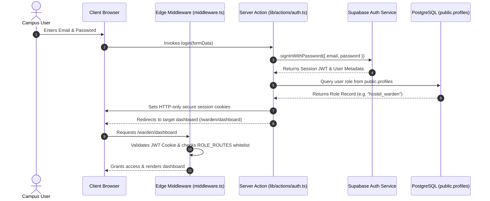
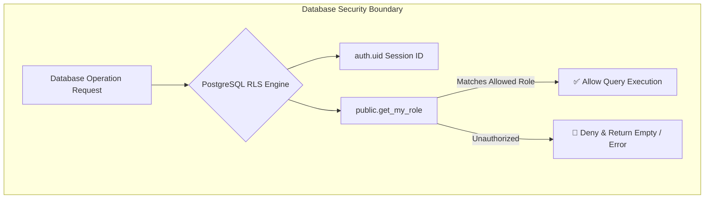

# 04. Authentication & Security Architecture

The **Smart Campus Management System (SCMS)** employs a secure, server-side authentication and session management architecture built on **Supabase Auth** and **Next.js SSR**. Security is enforced at three distinct layers: the Network Edge (Middleware), the Application Server (Server Actions), and the Database Engine (Row Level Security).

---

## 1. Authentication Lifecycle & Architecture



---

## 2. Authentication Capabilities

### 2.1. User Login (`/login`)
- **Action**: [`login(formData)`](file:///f:/Project/SMART%20CAMPUS%20MANAGEMENT%20SYSTEM/SMART-CAMPUS-MANAGEMENT-SYSTEM/my-app/lib/actions/auth.ts#L11-L35)
- **Mechanism**: Validates credentials against Supabase Auth. Upon successful verification, securely resolves the user's role from `public.profiles` (falling back to user metadata) and redirects the user to their designated role dashboard:
  - Super Admin ➔ `/admin/dashboard`
  - Student ➔ `/dashboard`
  - Faculty ➔ `/faculty/dashboard`
  - Librarian ➔ `/librarian/dashboard`
  - Event Organizer ➔ `/event-organizer/dashboard`
  - Bus Driver ➔ `/driver/dashboard`
  - Hostel Warden ➔ `/warden/dashboard`
  - Mess Manager ➔ `/mess-manager/dashboard`

### 2.2. User Logout
- **Action**: [`logout()`](file:///f:/Project/SMART%20CAMPUS%20MANAGEMENT%20SYSTEM/SMART-CAMPUS-MANAGEMENT-SYSTEM/my-app/lib/actions/auth.ts#L37-L42)
- **Mechanism**: Invokes `supabase.auth.signOut()`, purges all authentication cookies from the client browser, invalidates Next.js layout cache (`revalidatePath('/', 'layout')`), and redirects to `/login`.

### 2.3. Forgot Password (`/forgot-password`)
- **Action**: [`forgotPassword(formData)`](file:///f:/Project/SMART%20CAMPUS%20MANAGEMENT%20SYSTEM/SMART-CAMPUS-MANAGEMENT-SYSTEM/my-app/lib/actions/auth.ts#L44-L58)
- **Mechanism**: Accepts the registered campus email, triggers Supabase's secure token generator, and dispatches a recovery email with a password reset callback URL pointing to `${NEXT_PUBLIC_APP_URL}/reset-password`.

### 2.4. Reset Password (`/reset-password`)
- **Action**: [`resetPassword(formData)`](file:///f:/Project/SMART%20CAMPUS%20MANAGEMENT%20SYSTEM/SMART-CAMPUS-MANAGEMENT-SYSTEM/my-app/lib/actions/auth.ts#L60-L82)
- **Mechanism**: Accepts the new password, applies cryptographic updates via `supabase.auth.updateUser({ password })`, updates the user session, and re-routes the user to their respective role dashboard.

---

## 3. Edge-Level Route Protection

The platform utilizes a centralized Next.js Edge Middleware ([`middleware.ts`](file:///f:/Project/SMART%20CAMPUS%20MANAGEMENT%20SYSTEM/SMART-CAMPUS-MANAGEMENT-SYSTEM/my-app/middleware.ts)) that inspects incoming HTTP requests prior to server component rendering.

### 3.1. Route Classification

| Route Type           | URL Patterns                                                                                                              | Policy                                                                                                                                                |
| -------------------- | ------------------------------------------------------------------------------------------------------------------------- | ----------------------------------------------------------------------------------------------------------------------------------------------------- |
| **Public Routes**    | `/login`, `/forgot-password`, `/reset-password`, `/api/health`                                                            | Accessible without authentication. If an already authenticated user navigates to `/login`, they are automatically redirected to their role dashboard. |
| **Protected Routes** | `/admin/*`, `/dashboard/*`, `/library/*`, `/events/*`, `/hostel/*`, `/mess/*`, `/bus/*`, `/profile/*`, `/notifications/*` | Requires valid session JWT. Unauthenticated requests are redirected to `/login?redirect=<target_path>`.                                               |
| **Static Assets**    | `/_next/*`, `/favicon.ico`, `*.svg`, `*.png`, `*.jpg`                                                                     | Excluded from middleware processing via regex matcher.                                                                                                |

### 3.2. Unauthorized Navigation Handling
If an authenticated user attempts to access a path outside their assigned `ROLE_ROUTES` whitelist (e.g., a Student navigating directly to `/admin/users` or a Bus Driver attempting to open `/warden/dashboard`), the middleware intercepts the request and instantly redirects the user to their authorized home dashboard without displaying an unhandled exception or leaking application structure.

---

## 4. Session Handling & Token Refresh

- **HTTP-Only Cookies**: JWT tokens (`access_token` and `refresh_token`) are stored exclusively in HTTP-only, secure cookies with the `SameSite=Lax` attribute. JavaScript running in the browser cannot read or extract tokens via `document.cookie`, preventing Cross-Site Scripting (XSS) token theft.
- **Silent Refresh**: The `@supabase/ssr` client transparently handles token expiration. During SSR requests, if an access token has expired, the middleware automatically performs a refresh exchange and propagates updated cookie headers back to the browser.

---

## 5. Database Row Level Security (RLS)

Authentication checks at the routing layer are backed by strict database-level policies:



### Security Helper Function
The database defines a security definer function to evaluate caller identity without recursive policy loops:
```sql
CREATE OR REPLACE FUNCTION public.get_my_role()
RETURNS TEXT AS $$
  SELECT role FROM public.profiles WHERE id = auth.uid();
$$ LANGUAGE sql STABLE SECURITY DEFINER;
```

---

## 6. Security Best Practices & Compliance

1. **Parameterization & SQL Injection Defense**: All database mutations utilize Supabase query builders with strict parameter binding, preventing SQL injection vulnerabilities.
2. **Profile & Auth Synchronization**: The database enforces a trigger (`on_auth_user_created`) that automatically synchronizes new `auth.users` records with `public.profiles`.
3. **Secret Isolation**: `SUPABASE_SERVICE_ROLE_KEY` is restricted strictly to backend scripts and Server Actions. Client-facing components only access `NEXT_PUBLIC_SUPABASE_ANON_KEY`.
4. **Audit Trail**: High-impact administrative modifications (user deletion, role changes, venue modifications) generate persistent entries in `public.audit_logs`.

---

> [!NOTE]
> For details on residential and hostel-specific security procedures, proceed to [`05-hostel-management.md`](file:///f:/Project/SMART%20CAMPUS%20MANAGEMENT%20SYSTEM/SMART-CAMPUS-MANAGEMENT-SYSTEM/my-app/docs/05-hostel-management.md).
