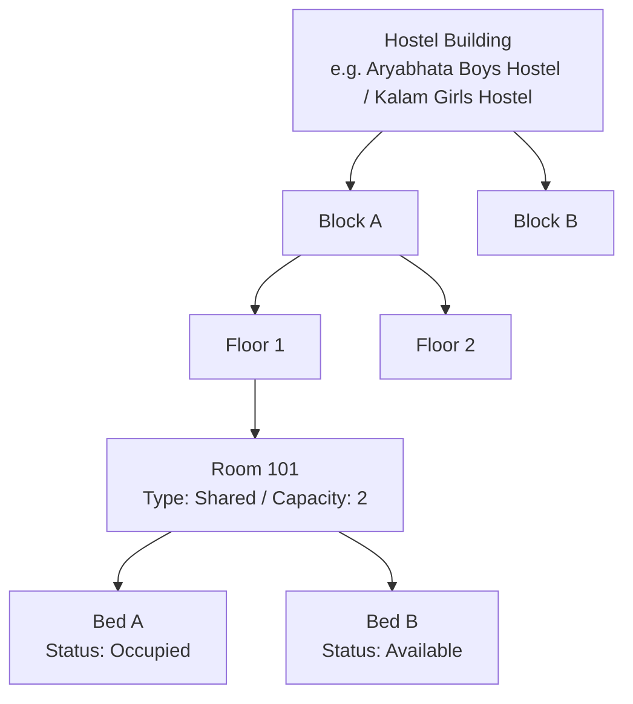
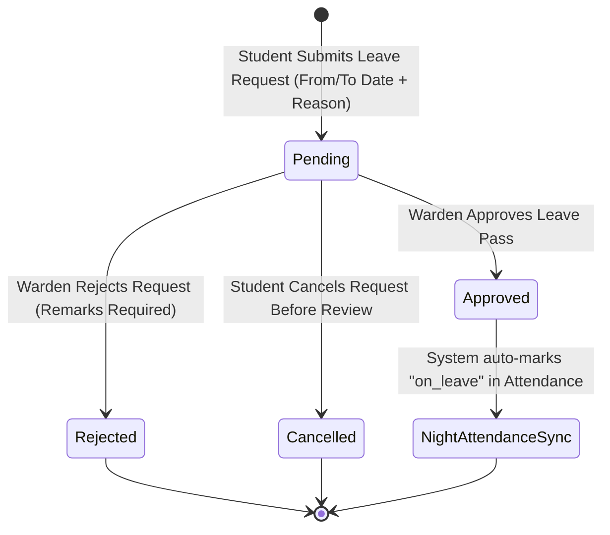

# 05. Hostel Management Module

The **Hostel Management Module** is a comprehensive residential administration system designed to manage multi-building student housing, physical bed-level allocations, gate-pass leave authorizations, daily night roll-call attendance, fee accounting, and facility maintenance ticketing.

---

## 1. Module Access & User Permissions

| Role                    | Access Level               | Primary Interface                 | Capabilities                                                                                                                          |
| ----------------------- | -------------------------- | --------------------------------- | ------------------------------------------------------------------------------------------------------------------------------------- |
| **Super Admin**         | Full Master Access         | `/hostel/manage`                  | Create hostel buildings, blocks, floors, rooms, configure fee schedules, view all analytics, override approvals.                      |
| **Hostel Warden**       | Operational Administration | `/warden/dashboard` & `/hostel/*` | Allocate/deallocate beds, review & approve/reject student leave requests, mark night attendance, resolve complaints, track fees.      |
| **Hosteller Student**   | Resident Self-Service      | `/hostel`                         | View assigned room/bed details, submit leave pass requests, track leave approval status, lodge maintenance complaints, view fee dues. |
| **Day Scholar Student** | **Restricted**             | None (Hidden)                     | Prohibited from accessing hostel services; hostel navigation items are automatically filtered from the sidebar.                       |
| **Faculty / Staff**     | **Restricted**             | None                              | Prohibited from accessing student housing management.                                                                                 |

---

## 2. Infrastructure Hierarchy & Bed Allocation

Residential housing is structured hierarchically to mirror physical campus premises:



### 2.1. Bed Status Lifecycle
Each individual bed unit transitions through three distinct operational states:
1. **`available`**: Clean, inspected, and ready for assignment to an eligible resident student.
2. **`occupied`**: Assigned to an active hosteller student. The database enforces a unique constraint (`idx_beds_unique_student`), preventing any student from occupying multiple beds simultaneously.
3. **`maintenance`**: Temporarily decommissioned due to repairs, plumbing, electrical, or structural maintenance.

### 2.2. Allocation Workflow
- **Bed Assignment**: The Warden or Super Admin selects an available bed and links a registered hosteller student. The system timestamps the assignment (`allocated_at`), sets the bed status to `occupied`, and creates an audit entry.
- **Deallocation (Check-Out)**: When a student vacates or graduates, the Warden executes deallocation. The bed reverts to `available`, and the student's residential profile is cleared.

---

## 3. Student Leave Request Workflow

To maintain campus safety and security, hosteller students must apply for a digital leave pass before exiting campus for vacations, home visits, or medical emergencies.



### 3.1. Leave Rules & Approval Mechanics
- **Submission**: Student provides `from_date`, `to_date`, and a descriptive `reason`.
- **Warden Review**:
  - **Approval**: Warden approves the request. The student receives a notification, and the student's status during those dates is synchronized with the night roll-call system.
  - **Rejection**: A mandatory explanatory remark must be entered by the Warden (e.g. *"Academic test scheduled on requested date"*), ensuring full transparency.

---

## 4. Night Roll-Call Attendance

- **Schedule**: Conducted nightly by the Warden or residential staff.
- **Statuses**:
  - **`present`**: Student is physically verified inside their assigned room.
  - **`absent`**: Student is absent without an approved leave pass (triggers warden alert).
  - **`on_leave`**: Student is on an active, approved leave pass.
- **Batch Processing**: Wardens can mark attendance by room or whole floor in a single consolidated grid view.

---

## 5. Hostel Fee Management

The fee subsystem handles room rent, utility levies, and maintenance dues:

| Field              | Description                                                 | Example                     |
| ------------------ | ----------------------------------------------------------- | --------------------------- |
| **Billing Period** | Academic term, semester, or monthly period code             | `2026-Semester-1`           |
| **Fee Amount**     | Prescribed fee for room/bed tier                            | `₹35,000.00`                |
| **Due Date**       | Deadline for payment settlement                             | `2026-03-31`                |
| **Payment Status** | Flag indicating if payment is settled (`paid = true/false`) | `PAID` / `PENDING`          |
| **Payment Record** | Warden records physical/online payment with receipt URL     | Recorded timestamp & amount |

---

## 6. Maintenance & Grievance Complaints

Students can report residential issues through a categorized ticketing system:

- **Categories**: `maintenance` (plumbing/electrical), `cleanliness`, `food`, `security`, `noise`, `other`.
- **Priority Levels**: `low`, `medium`, `high`, `urgent`.
- **Resolution Lifecycle**:
  ```
  [open] ──► [in_progress] ──► [resolved] ──► [closed]
  ```
- Wardens can log resolution actions and record the resolving officer's identity.

---

## 7. Hostel Analytics & Data Export

The Warden Dashboard provides real-time operational KPI cards and charts:
- **Total & Available Beds**: Occupancy rate percentage.
- **Active Leave Passes**: Count of students currently off-campus.
- **Pending Complaints**: Urgent and open maintenance tickets.
- **Fee Collection Rate**: Percentage of collected versus outstanding dues.
- **Export Capabilities**: Direct CSV export for student resident directories, room occupancy sheets, and fee collection summaries.

---

> [!NOTE]
> For dining and mess catering operations integrated with hostel life, refer to [`06-mess-management.md`](file:///f:/Project/SMART%20CAMPUS%20MANAGEMENT%20SYSTEM/SMART-CAMPUS-MANAGEMENT-SYSTEM/my-app/docs/06-mess-management.md).
