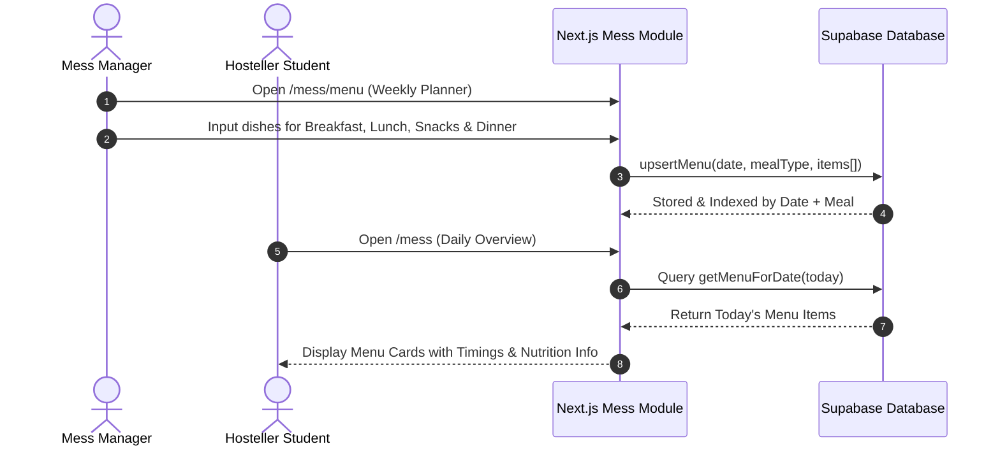
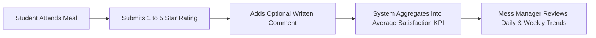

# 06. Mess & Dining Management Module

The **Mess & Dining Management Module** manages institutional food services, nutritional menu scheduling, meal attendance headcounts, student satisfaction feedback, and kitchen hygiene compliance for resident campus students.

---

## 1. Access Roles & Restrictions

| Role                    | Access Level            | Primary Route                         | Operational Scope                                                                                                     |
| ----------------------- | ----------------------- | ------------------------------------- | --------------------------------------------------------------------------------------------------------------------- |
| **Super Admin**         | Full Master Access      | `/mess/manage`                        | Master configuration, menu override, cross-department analytics, catering audit logs.                                 |
| **Mess Manager**        | Catering Administration | `/mess-manager/dashboard` & `/mess/*` | Publish weekly meal menus, log dining attendance, track ratings, resolve food complaints, review student suggestions. |
| **Hosteller Student**   | Dining Consumer         | `/mess`                               | View daily & weekly menus, record meal attendance, submit 1–5 star ratings, submit complaints & suggestions.          |
| **Day Scholar Student** | **Restricted**          | None (Hidden)                         | Prohibited from accessing mess services; mess navigation items are hidden from the sidebar.                           |
| **Faculty / Staff**     | **Restricted**          | None                                  | Prohibited from accessing student mess catering management.                                                           |

---

## 2. Meal Slots & Operational Timetable

The system organizes dining into four standard daily meal windows defined in system constants:

| Meal Slot   | Display Label      | Standard Operational Timetable | Icon |
| ----------- | ------------------ | ------------------------------ | :--: |
| `breakfast` | **Breakfast**      | 07:30 AM – 09:00 AM            |  ☕   |
| `lunch`     | **Lunch**          | 12:00 PM – 02:00 PM            | 🍽️  |
| `snacks`    | **Evening Snacks** | 04:30 PM – 05:30 PM            |  🥗  |
| `dinner`    | **Dinner**         | 07:30 PM – 09:30 PM            |  🌙  |

---

## 3. Menu Planning & Publishing Workflow

### 3.1. Menu Management Capabilities
- **Flexible Items Format**: Menu items are stored as JSON arrays (e.g. `["Paneer Butter Masala", "Jeera Rice", "Dal Tadka", "Tawa Roti", "Gulab Jamun"]`), allowing rich multi-item entries per slot.
- **Weekly Schedule View**: Managers can pre-plan the full 7-day calendar in advance, preventing last-minute scheduling gaps.
- **Instant Publication**: Edits made by the manager immediately reflect on student dashboards upon browser refresh.

---

## 4. Meal Attendance & Headcount Verification

- **Purpose**: Helps the catering staff estimate kitchen procurement, reduce food wastage, and verify student dining presence.
- **Action**: [`markMessAttendance(studentId, date, mealType, present)`](file:///f:/Project/SMART%20CAMPUS%20MANAGEMENT%20SYSTEM/SMART-CAMPUS-MANAGEMENT-SYSTEM/my-app/lib/actions/mess.ts#L169-L200)
- **Constraint**: The database enforces a unique index `(student_id, date, meal_type)` to prevent duplicate check-ins for the same meal slot.

---

## 5. Food Ratings & Student Feedback

Hosteller students can provide quality feedback after every meal:

- **Rating Scale**: 1 Star (*Poor*) to 5 Stars (*Excellent*).
- **Rule**: One feedback submission per student per meal slot per date.
- **Analytics**: Calculates average meal satisfaction score and daily sentiment trends.

---

## 6. Grievance Redressal & Suggestions Box

### 6.1. Mess Complaints
Students can lodge formal complaints regarding dining issues:
- **Categories**:
  - `quality` (Taste, undercooked, freshness)
  - `hygiene` (Cleanliness of utensils, dining hall sanitation)
  - `quantity` (Portion size, shortages during peak hours)
  - `service` (Staff behavior, delay in serving)
  - `other` (General catering issues)
- **Resolution Statuses**: `open` ➔ `in_progress` ➔ `resolved` ➔ `closed`.
- **Manager Actions**: The Mess Manager can update the status, append resolution remarks, and log the resolving officer.

### 6.2. Student Suggestion Box
Students can propose menu additions, special festival dishes, or dietary improvements:
- **Status Pipeline**: `pending` ➔ `under_review` ➔ `implemented` / `rejected`.
- Provides a collaborative mechanism for students to influence future menu revisions.

---

## 7. Mess Analytics & KPI Dashboard

The Mess Manager Dashboard ([`/mess-manager/dashboard`](file:///f:/Project/SMART%20CAMPUS%20MANAGEMENT%20SYSTEM/SMART-CAMPUS-MANAGEMENT-SYSTEM/my-app/app/(dashboard)/mess-manager/dashboard/page.tsx)) provides real-time dining intelligence:
- **Average Satisfaction Rating**: Aggregated institutional score out of 5.0.
- **Daily Meal Attendance Count**: Headcounts across breakfast, lunch, snacks, and dinner.
- **Active Complaint Count**: Breakdown of open vs resolved catering tickets.
- **Weekly Rating Trends**: Graphical distribution comparing meal quality over time.

---

> [!NOTE]
> For campus transportation and shuttle bus management for Day Scholars, proceed to [`07-bus-management.md`](file:///f:/Project/SMART%20CAMPUS%20MANAGEMENT%20SYSTEM/SMART-CAMPUS-MANAGEMENT-SYSTEM/my-app/docs/07-bus-management.md).
