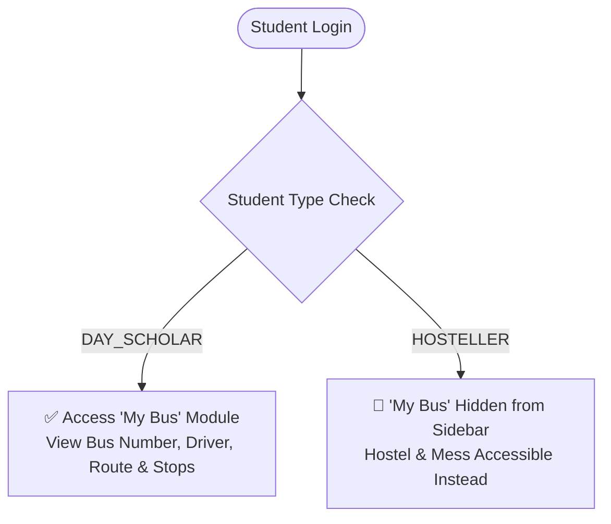
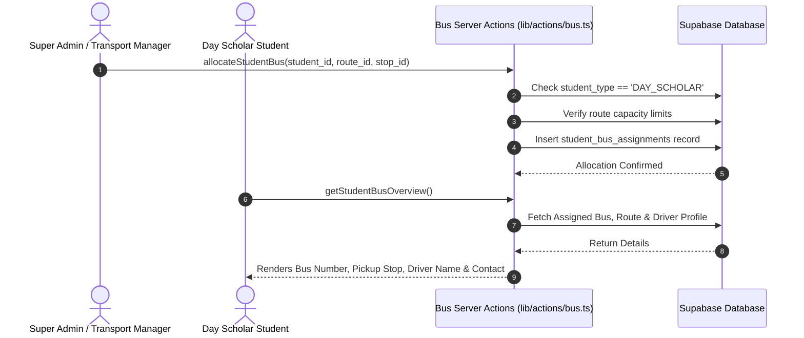
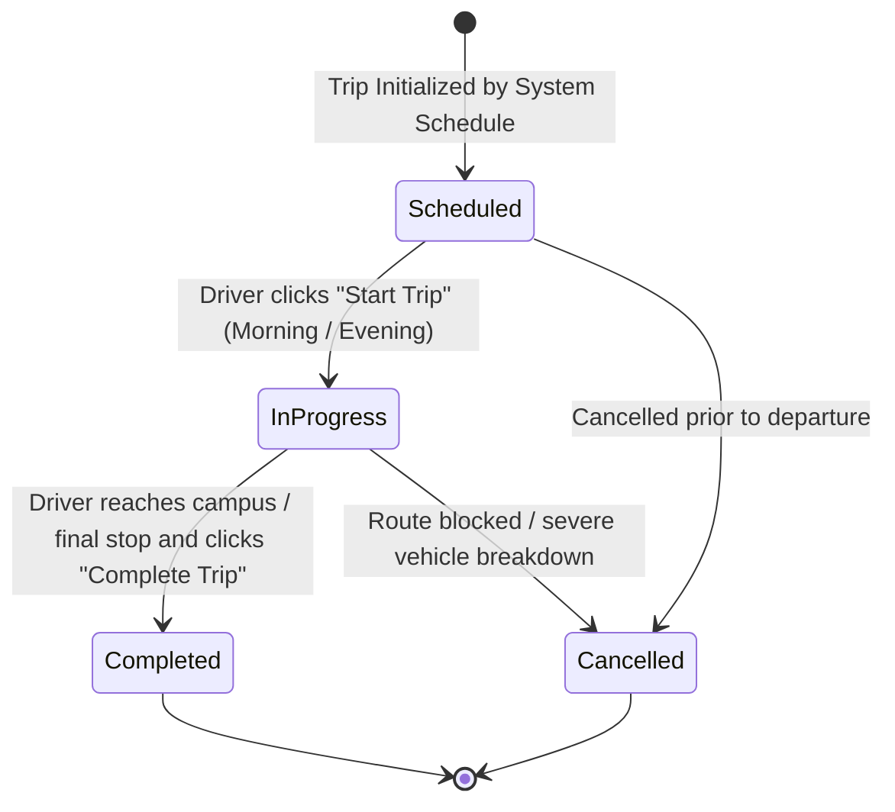

# 07. Bus & Transport Management Module

The **Bus & Transport Management Module** manages institutional fleet operations, route planning, ordered bus stop waypoints, driver dispatching, Day Scholar bus pass allocations, and vehicle breakdown grievance ticketing.

---

## 1. Access Roles & Student Type Restrictions



| Role                    | Access Level           | Primary Route       | Operational Scope                                                                                                |
| ----------------------- | ---------------------- | ------------------- | ---------------------------------------------------------------------------------------------------------------- |
| **Super Admin**         | Full Fleet Control     | `/bus/manage`       | Create buses, configure routes, sequence stops, assign drivers, allocate student bus passes, view analytics.     |
| **Bus Driver**          | Trip Operations        | `/driver/dashboard` | View assigned vehicle and passenger stops, toggle live trip statuses, submit breakdown and repair reports.       |
| **Day Scholar Student** | Passenger Self-Service | `/bus`              | View assigned vehicle number, driver contact details, route path, pickup stop location, and scheduled timings.   |
| **Hosteller Student**   | **Restricted**         | None (Hidden)       | Prohibited from accessing daily commuter bus routes; navigation item is automatically filtered from the sidebar. |
| **Faculty / Staff**     | **Restricted**         | None                | Prohibited from accessing student fleet transit management.                                                      |

---

## 2. Fleet & Route Hierarchy

Transit logistics are structured into vehicles, routes, and sequenced waypoints:

```mermaid
graph LR
    Bus[🚌 Bus Fleet<br/>Bus #, Model, Capacity] --- Driver[👨‍✈️ Assigned Driver]
    Route[🗺️ Route Definition<br/>e.g. Route 1: North Campus Shuttle] --- Bus
    Route --> Stop1[📍 Stop 1: Central Station (Order: 1)]
    Route --> Stop2[📍 Stop 2: City Square (Order: 2)]
    Route --> Stop3[📍 Stop 3: Main Campus Gate (Order: 3)]
    Stop2 -.-> Student[🎓 Day Scholar Passenger Allocation]
```

### 2.1. Bus Fleet Management
- **Attributes**: `bus_number` (Unique registration code), `capacity` (Total passenger seats, e.g. 50), `model` (e.g. *Tata Starbus Ultra*), `is_active` (Operational status flag).
- **Driver Linking**: Each bus can be assigned an authorized `bus_driver` profile from the staff directory.

### 2.2. Route & Stop Sequencing
- **Routes**: Named transit corridors (e.g. *"Route 4: Tech Corridor Express"*).
- **Stops**: Ordered waypoints assigned an explicit sequence integer (`stop_order`), geographic coordinates (`latitude`, `longitude`), and designated pickup name. The database enforces a composite unique constraint `(route_id, stop_order)` to prevent duplicate or scrambled stop sequences.

---

## 3. Student Bus Allocation Workflow

To ensure seats do not exceed vehicle capacity, Day Scholars must be registered for a designated route:



### Allocation Rules
1. **Single Pass Enforcement**: A student can hold only one active bus assignment at any given time (`UNIQUE(student_id)`).
2. **Deallocation**: Admins can deallocate or transfer students between routes when residential addresses change.

---

## 4. Driver Dashboard & Trip Lifecycle

The Bus Driver interface ([`/driver/dashboard`](file:///f:/Project/SMART%20CAMPUS%20MANAGEMENT%20SYSTEM/SMART-CAMPUS-MANAGEMENT-SYSTEM/my-app/app/(dashboard)/driver/dashboard/page.tsx)) provides real-time transit controls:



### Trip Classifications:
- `morning`: Commuter pickup run from city stops to campus.
- `evening`: Return journey from campus to residential drop-offs.
- `special`: Academic field trips, sports meets, or guest transportation.

---

## 5. Vehicle Breakdown & Problem Reporting

Drivers can immediately notify transport dispatch of mechanical faults, delays, or emergencies:
- **Incident Types**: Engine failure, flat tire, traffic bottleneck, air conditioning failure, electrical fault.
- **Urgency Statuses**: `open` ➔ `in_progress` ➔ `resolved` ➔ `closed`.
- **Administrative Tracking**: Super Admins monitor active tickets to dispatch replacement backup buses and avoid student transit delays.

---

## 6. Fleet Analytics & Export

The Transport Admin interface provides comprehensive operational metrics:
- **Fleet Utilization**: Active vs in-maintenance bus counts.
- **Seat Occupancy**: Total seats filled across all active routes.
- **Active Trips**: Live count of buses currently en route.
- **Export Capabilities**: Instant CSV downloads for passenger manifests by stop, driver duty rosters, and maintenance history logs.

---

> [!NOTE]
> For venue booking, auditorium scheduling, and campus events, proceed to [`08-event-management.md`](file:///f:/Project/SMART%20CAMPUS%20MANAGEMENT%20SYSTEM/SMART-CAMPUS-MANAGEMENT-SYSTEM/my-app/docs/08-event-management.md).
