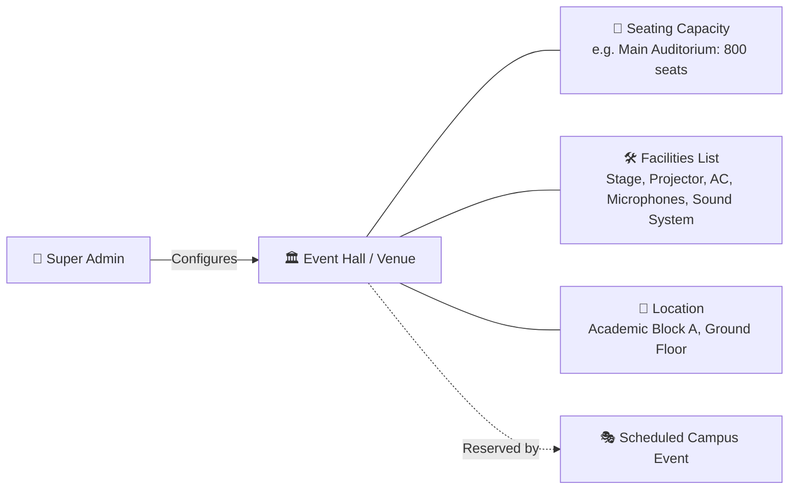
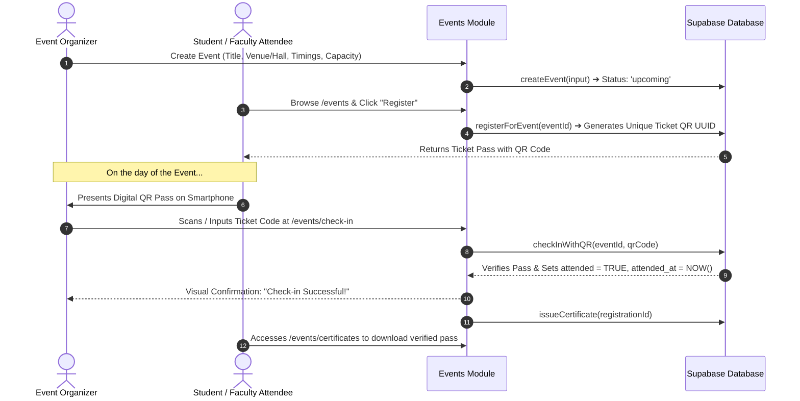

# 08. Event & Venue Management Module

The **Event & Venue Management Module** coordinates campus extracurricular activities, technical symposiums, guest lectures, cultural fests, and auditorium venue bookings with automated QR-code attendance verification and digital certificate distribution.

---

## 1. Access Roles & Responsibilities

| Role                | Access Level           | Primary Route                                   | Capabilities                                                                                                                             |
| ------------------- | ---------------------- | ----------------------------------------------- | ---------------------------------------------------------------------------------------------------------------------------------------- |
| **Super Admin**     | Master Control         | `/admin/halls` & `/events`                      | Create & configure physical event halls/venues, manage facility amenities, oversee all campus events, delete/modify events.              |
| **Event Organizer** | Event Producer         | `/event-organizer/dashboard` & `/events/manage` | Create events, reserve campus halls, set registration deadlines and capacities, run live QR ticket check-ins, view attendance analytics. |
| **Student**         | Attendee / Participant | `/events` & `/events/certificates`              | Browse upcoming events, register with one click, receive digital QR admission tickets, download earned participation certificates.       |
| **Faculty Member**  | Attendee / Coordinator | `/faculty/dashboard` & `/events`                | Register for academic conferences and workshops open to faculty, receive QR passes, earn digital completion certificates.                |

---

## 2. Campus Hall & Venue Management

Physical campus venues are managed centrally in the `event_halls` directory by the Super Admin to prevent scheduling conflicts:

### 2.1. Seeded Campus Venues
1. **Main Auditorium**: 800 seats · Stage, Projector, Central AC, Sound System, Backstage.
2. **Seminar Hall 1**: 200 seats · HD Projector, AC, Whiteboard, Wireless Microphones.
3. **Open Air Theatre**: 1,500 seats · Open amphitheater, Stage, Concert Sound, Large Screen.
4. **Conference Room A**: 50 seats · Video Conferencing, Smart Board, Executive Seating.

### 2.2. Conflict & Double-Booking Prevention
When an organizer reserves a hall for a specific time window `(start_time, end_time)`, the scheduling action validates that no overlapping active event (`status != 'cancelled'`) is booked in the same hall, preventing venue clashes.

---

## 3. End-to-End Event Lifecycle & Check-In

---

## 4. Event Categories & Status States

### 4.1. Event Categories
Events are tagged by visual category chips with custom theme colors:
- 🔵 **Technical**: Hackathons, coding competitions, robotics expos.
- 🟡 **Cultural**: Music concerts, drama performances, annual fest.
- 🟢 **Sports**: Inter-collegiate tournaments, athletics meets.
- 🌸 **Workshop**: Hands-on technical and career training sessions.
- 🔷 **Seminar**: Academic research talks and guest lectures.
- 🔴 **Competition**: Debates, quizzes, business case challenges.

### 4.2. Event Lifecycle Statuses
1. **`draft`**: Being composed by the organizer; hidden from public student views.
2. **`upcoming`**: Published and open for attendee discovery and registrations.
3. **`ongoing`**: Currently live on campus; active QR check-in terminal open.
4. **`completed`**: Concluded event; attendance finalized; certificates issued.
5. **`cancelled`**: Cancelled event; attendees notified automatically.

---

## 5. QR Code Check-In Terminal

- **Route**: [`/events/check-in`](file:///f:/Project/SMART%20CAMPUS%20MANAGEMENT%20SYSTEM/SMART-CAMPUS-MANAGEMENT-SYSTEM/my-app/app/(dashboard)/events/check-in/page.tsx)
- **Scanning Mode**: Supports fast webcam/mobile camera QR scanning or manual alphanumeric code input.
- **Instant Validation**: Prevents double check-ins by verifying if `attended` is already marked true, displaying clear visual alerts for invalid or reused passes.

---

## 6. Digital Participation Certificates

- **Route**: [`/events/certificates`](file:///f:/Project/SMART%20CAMPUS%20MANAGEMENT%20SYSTEM/SMART-CAMPUS-MANAGEMENT-SYSTEM/my-app/app/(dashboard)/events/certificates/page.tsx)
- **Eligibility**: Issued automatically to students and faculty members who have their attendance verified during the live check-in process.
- **Verification Data**: Displays event title, attendee name, department, roll/employee number, completion date, and verified certificate ID.

---

## 7. Event Analytics & Roster Export

The Organizer & Admin Dashboards provide live audience metrics:
- **Total Registrations vs Hall Capacity**: Percentage fill-rate indicator.
- **Turnout / Attendance Rate**: Ratio of registered users who physically checked in.
- **Category Popularity**: Participation breakdown across sports, technical, and cultural domains.
- **Export Capabilities**: CSV export of participant rosters with contact info, registration timestamps, and attendance records.

---

> [!NOTE]
> For library book circulation, cataloging, and overdue fines, proceed to [`09-library-management.md`](file:///f:/Project/SMART%20CAMPUS%20MANAGEMENT%20SYSTEM/SMART-CAMPUS-MANAGEMENT-SYSTEM/my-app/docs/09-library-management.md).
