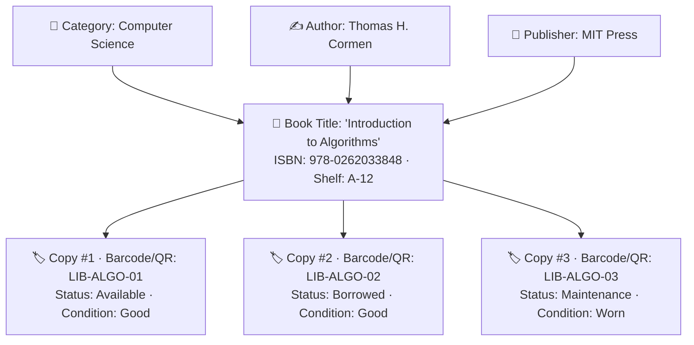
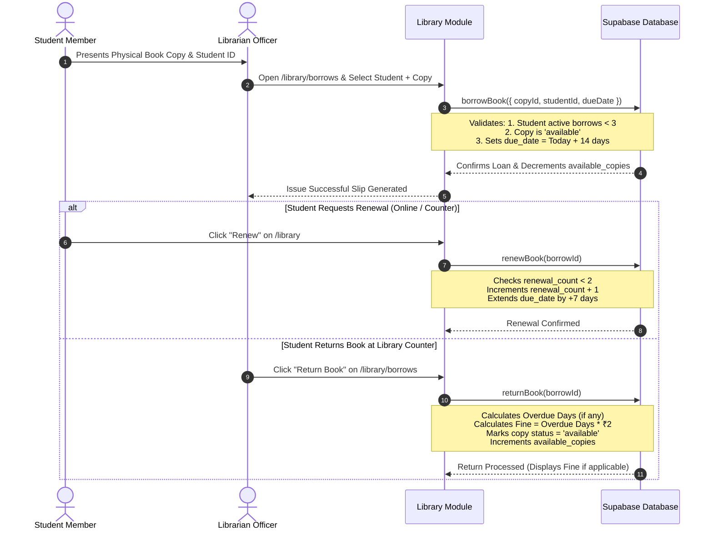

# 09. Library Management Module

The **Library Management Module** is a full-lifecycle bibliographic automation suite designed to manage campus book acquisitions, multi-author cataloging, publisher directories, individual physical copy barcodes/QR codes, student borrowing limits, due date tracking, automated overdue fine computations (₹2/day), and fine waiver authorizations.

---

## 1. Access Roles & System Permissions

| Role               | Access Level                  | Primary Route                         | Capabilities                                                                                                                                            |
| ------------------ | ----------------------------- | ------------------------------------- | ------------------------------------------------------------------------------------------------------------------------------------------------------- |
| **Super Admin**    | Master Control                | `/library`                            | Full oversight, catalog configuration, fine auditing, borrowing overrides.                                                                              |
| **Librarian**      | Catalog & Circulation Control | `/librarian/dashboard` & `/library/*` | Add/edit books, manage authors/categories/publishers, issue & return book copies, process renewals, collect or waive fines, view circulation analytics. |
| **Student**        | Library Member                | `/library`                            | Search book catalog, filter by category/author/availability, check personal borrow history, monitor return deadlines, initiate book renewals online.    |
| **Faculty Member** | Library Member                | `/library`                            | Browse campus catalog, inspect shelf locations, check book availability.                                                                                |

---

## 2. Bibliographic Data Structure & Copy Tracking

To accurately track multiple physical copies of the same book title, the system separates bibliographic metadata from physical inventory:

### 2.1. Physical Copy Statuses
- **`available`**: On the shelf; ready for immediate loan.
- **`borrowed`**: Currently issued to an active student.
- **`overdue`**: Retained past the return deadline.
- **`damaged`**: Needs binding or physical repair.
- **`lost`**: Reported missing or lost.
- **`maintenance`**: Temporarily withdrawn for inventory audit.

---

## 3. Circulation Rules & Lending Policies

The circulation engine enforces institutional lending parameters configured in [`lib/constants.ts`](file:///f:/Project/SMART%20CAMPUS%20MANAGEMENT%20SYSTEM/SMART-CAMPUS-MANAGEMENT-SYSTEM/my-app/lib/constants.ts#L8-L16):

| Lending Parameter            | System Value          | Rule Rationale                                              |
| ---------------------------- | --------------------- | ----------------------------------------------------------- |
| **Standard Borrow Period**   | **14 Days**           | Default loan duration before late fines accumulate.         |
| **Maximum Active Borrows**   | **3 Books / Student** | Prevents resource hoarding across the student body.         |
| **Maximum Renewals**         | **2 Extensions**      | Caps borrowing duration to a maximum of 28 total days.      |
| **Renewal Period Extension** | **+7 Days / Renewal** | Grants an additional week per successful renewal.           |
| **Overdue Fine Rate**        | **₹2.00 / Day**       | Automatically accumulates daily after the due date expires. |

---

## 4. Borrowing, Renewal & Return Lifecycle

---

## 5. Fine Accounting & Administrative Waivers

When a book is returned after its scheduled due date, the system records the overdue fee:

| Fine Status | Description                                                               | Permitted Actions                                              |
| ----------- | ------------------------------------------------------------------------- | -------------------------------------------------------------- |
| `PENDING`   | Overdue fee assessed but unpaid by student.                               | Student can pay; Librarian can waive.                          |
| `PAID`      | Fee settled at the library counter.                                       | Payment timestamp & receipt recorded.                          |
| `WAIVED`    | Overdue fee forgiven due to authorized medical or administrative reasons. | Librarian/Admin logs waiver reason (`waived_at`, `waived_by`). |

---

## 6. Catalog Search & Filter Engine

The book search engine supports multi-faceted queries across the entire collection:
- **Keyword Match**: Instant search by Title, Subtitle, or ISBN.
- **Category Filter**: Filter by departments (Computer Science, Electronics, Mechanical, Mathematics, Literature, Management).
- **Author & Publisher Filter**: Browse works by specific authors or academic presses.
- **Availability Toggle**: One-click filter to display only books currently in stock (`available_copies > 0`).

---

## 7. Library Analytics & Data Export

The Librarian Dashboard ([`/librarian/dashboard`](file:///f:/Project/SMART%20CAMPUS%20MANAGEMENT%20SYSTEM/SMART-CAMPUS-MANAGEMENT-SYSTEM/my-app/app/(dashboard)/librarian/dashboard/page.tsx)) provides real-time circulation metrics:
- **Total Titles & Copies**: Complete campus holding count.
- **Active Loans & Overdue Books**: Real-time count of outstanding books.
- **Total Accumulated & Collected Fines**: Financial accounting of library late dues.
- **Popular Categories & Most-Borrowed Titles**: Circulation charts.
- **Export Capabilities**: CSV export for the entire catalog, fine collection ledgers, and overdue reminder rosters.

---

> [!NOTE]
> For campus notification dispatch mechanics across all modules, proceed to [`10-notifications.md`](file:///f:/Project/SMART%20CAMPUS%20MANAGEMENT%20SYSTEM/SMART-CAMPUS-MANAGEMENT-SYSTEM/my-app/docs/10-notifications.md).
