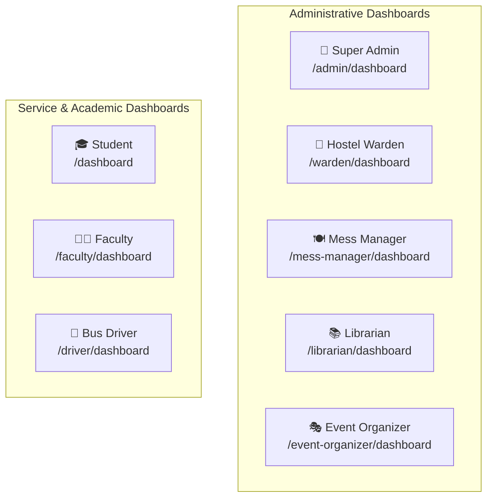

# 11. Dashboards & Institutional Analytics

Every authenticated campus role is greeted with a tailored **Operational Dashboard** designed to highlight high-priority action items, immediate KPI cards, visual charts, and direct shortcuts relevant to their organizational domain.

---

## 1. Summary of Campus Role Dashboards

---

## 2. Comprehensive Breakdown by Dashboard

### 2.1. Super Admin Dashboard ([`/admin/dashboard`](file:///f:/Project/SMART%20CAMPUS%20MANAGEMENT%20SYSTEM/SMART-CAMPUS-MANAGEMENT-SYSTEM/my-app/app/(dashboard)/admin/dashboard/page.tsx))
- **Target Audience**: Campus Chancellor, IT Director, Dean of Administration.
- **KPI Stat Cards**:
  - `Total Users`: Overall active accounts across all 8 roles.
  - `Total Students`: Headcount of registered campus learners.
  - `Total Books`: Total bibliographic titles cataloged in the library.
  - `Total Events`: Total campus events scheduled.
  - `Total Buses`: Active vehicle fleet count.
  - `Total Hostels`: Active student residential buildings.
- **Visuals & Tables**:
  - **Module Quick Access Grid**: Direct navigation to Library, Events, Bus, Hostel, and Mess modules.
  - **Recent Users Table**: Latest registered profiles with role badges and timestamps.
  - **System Overview Card**: Distribution of user accounts categorized by role.
- **Quick Actions**: Manage Users, View System Audit Logs.

---

### 2.2. Student Dashboard ([`/dashboard`](file:///f:/Project/SMART%20CAMPUS%20MANAGEMENT%20SYSTEM/SMART-CAMPUS-MANAGEMENT-SYSTEM/my-app/app/(dashboard)/dashboard/page.tsx))
- **Target Audience**: Undergraduate & Postgraduate Students.
- **Adaptive Display (Hosteller vs Day Scholar)**:
  - **Hosteller**: Displays Book Borrows, Registered Events, Room/Bed Info, and Today's Mess Meals.
  - **Day Scholar**: Displays Book Borrows, Registered Events, and Assigned Bus Route/Pickup Stop.
- **KPI Stat Cards**:
  - `Books Borrowed`: Active loans with overdue warning counter.
  - `Events Registered`: Upcoming events registered with tickets.
  - `Bus Route / Room`: Assigned transport route or hostel bed.
  - `Today's Meals`: Published meal menus available for the day.
- **Quick Links**: Browse Books, Discover Events, View Certificates, Submit Grievance.

---

### 2.3. Faculty Dashboard ([`/faculty/dashboard`](file:///f:/Project/SMART%20CAMPUS%20MANAGEMENT%20SYSTEM/SMART-CAMPUS-MANAGEMENT-SYSTEM/my-app/app/(dashboard)/faculty/dashboard/page.tsx))
- **Target Audience**: Professors, Associate Professors, Departmental Heads.
- **KPI Stat Cards**:
  - `Events Registered`: Academic conferences, faculty development programs, and symposiums registered.
  - `Events Attended`: Physically checked-in events.
  - `Certificates Earned`: Verified digital credentials available for download.
- **Visuals & Tables**:
  - **My Registered Events Table**: Upcoming faculty events with category badges and status.
  - **Upcoming Events Open to Faculty**: Discoverable academic lectures and workshops.
- **Quick Links**: Browse Events, Download Certificates, Profile Settings.

---

### 2.4. Librarian Dashboard ([`/librarian/dashboard`](file:///f:/Project/SMART%20CAMPUS%20MANAGEMENT%20SYSTEM/SMART-CAMPUS-MANAGEMENT-SYSTEM/my-app/app/(dashboard)/librarian/dashboard/page.tsx))
- **Target Audience**: Chief Librarian, Circulation Desk Officers.
- **KPI Stat Cards**:
  - `Total Catalog Titles`: Unique book titles in holding.
  - `Active Borrows`: Books currently in circulation.
  - `Overdue Borrows`: Loans past the 14-day lending threshold.
  - `Total Library Members`: Registered student & faculty patrons.
- **Visuals & Charts**:
  - **Circulation Trends Chart**: Monthly borrow vs return rate visual.
  - **Category Distribution**: Holdings broken down by technical/academic subject.
  - **Recent Borrow Transactions Table**: Student name, book title, borrow date, and return status.
- **Quick Actions**: Add New Book, Issue Book Copy, Return Processing, Waive/Collect Fines.

---

### 2.5. Event Organizer Dashboard ([`/event-organizer/dashboard`](file:///f:/Project/SMART%20CAMPUS%20MANAGEMENT%20SYSTEM/SMART-CAMPUS-MANAGEMENT-SYSTEM/my-app/app/(dashboard)/event-organizer/dashboard/page.tsx))
- **Target Audience**: Student Affairs Directors, Cultural Secretaries, Club Leads.
- **KPI Stat Cards**:
  - `My Events Total`: Cumulative events created by the organizer.
  - `Upcoming Events`: Published events awaiting execution.
  - `Total Registrations`: Total attendee tickets issued.
  - `Attendance Rate %`: Verified physical check-in ratio.
- **Visuals & Tables**:
  - **My Events Roster**: Status indicators (`upcoming`, `ongoing`, `completed`).
  - **Recent Registrations Feed**: Live attendee stream with student names and registration timestamps.
- **Quick Actions**: Create Event, Launch QR Check-In Terminal, View Event Analytics.

---

### 2.6. Bus Driver Dashboard ([`/driver/dashboard`](file:///f:/Project/SMART%20CAMPUS%20MANAGEMENT%20SYSTEM/SMART-CAMPUS-MANAGEMENT-SYSTEM/my-app/app/(dashboard)/driver/dashboard/page.tsx))
- **Target Audience**: Campus Transit Drivers.
- **Assigned Vehicle Hero**: Displays assigned bus registration number, model, capacity, and current active route.
- **Ordered Route Waypoints**: Sequence of stops with pickup orders and map coordinates.
- **Live Trip Controller**:
  - Start Morning / Evening Trip (`in_progress`).
  - Complete Trip (`completed`).
  - Cancel Trip / Log Delay Notes.
- **Vehicle Maintenance Reporting**: Submit quick mechanical fault tickets.

---

### 2.7. Hostel Warden Dashboard ([`/warden/dashboard`](file:///f:/Project/SMART%20CAMPUS%20MANAGEMENT%20SYSTEM/SMART-CAMPUS-MANAGEMENT-SYSTEM/my-app/app/(dashboard)/warden/dashboard/page.tsx))
- **Target Audience**: Chief Hostel Warden, Assistant Wardens.
- **KPI Stat Cards**:
  - `Occupancy Rate %`: Occupied beds vs total capacity.
  - `Pending Leave Requests`: Student gate-pass applications awaiting review.
  - `Open Complaints`: Unresolved plumbing/electrical/cleanliness maintenance tickets.
  - `Fee Defaulters`: Students with outstanding semester hostel dues.
- **Operational Tables**:
  - **Leave Pass Approval Queue**: Fast one-click Approve / Reject (with mandatory remarks).
  - **Room Matrix Grid**: Visual bed occupancy breakdown by block and floor.
- **Quick Actions**: Allocate Bed, Mark Night Attendance, Log Fee Payment, Export Residents CSV.

---

### 2.8. Mess Manager Dashboard ([`/mess-manager/dashboard`](file:///f:/Project/SMART%20CAMPUS%20MANAGEMENT%20SYSTEM/SMART-CAMPUS-MANAGEMENT-SYSTEM/my-app/app/(dashboard)/mess-manager/dashboard/page.tsx))
- **Target Audience**: Dining Director, Executive Chef, Catering Supervisor.
- **KPI Stat Cards**:
  - `Average Food Rating`: Composite student score out of 5.0 ⭐.
  - `Today's Dining Attendance`: Headcount verified for Breakfast, Lunch, Snacks, and Dinner.
  - `Active Grievance Tickets`: Open dining/hygiene complaints.
  - `Menu Suggestions`: Student menu ideas awaiting review.
- **Visuals & Tables**:
  - **Weekly Menu Planner Grid**: 7-day multi-meal dish editor.
  - **Feedback & Complaints Ledger**: Student comments, ratings, and resolution statuses.
- **Quick Actions**: Edit Today's Menu, Mark Meal Attendance, Resolve Complaint, Export Dining Stats.

---

> [!NOTE]
> For a structured, module-by-module permission breakdown, proceed to [`12-crud-and-permissions.md`](file:///f:/Project/SMART%20CAMPUS%20MANAGEMENT%20SYSTEM/SMART-CAMPUS-MANAGEMENT-SYSTEM/my-app/docs/12-crud-and-permissions.md).
