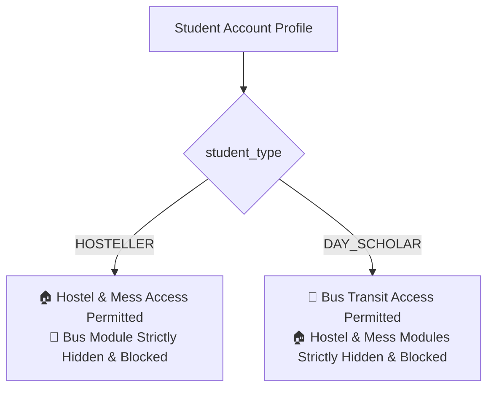
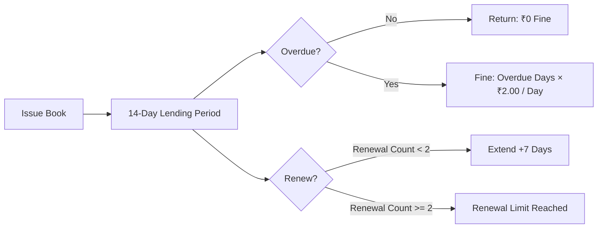

# 13. Institutional Business Rules & Policies

This document formalizes the operational policies, database integrity constraints, and business logic hardcoded into the **Smart Campus Management System (SCMS)**.

---

## 1. Student Residency Segregation Rules



1. **Hosteller Exclusivity**: Students designated as `HOSTELLER` are granted full access to residential room tracking, night attendance, leave applications, and dining menus. They are prohibited from occupying bus seats or accessing commuter bus routes.
2. **Day Scholar Exclusivity**: Students designated as `DAY_SCHOLAR` are granted access to route transit details and stop schedules. They cannot apply for hostel rooms or submit mess ratings.
3. **Enforcement Mechanism**: Enforced in UI navigation ([`AppSidebar.tsx`](file:///f:/Project/SMART%20CAMPUS%20MANAGEMENT%20SYSTEM/SMART-CAMPUS-MANAGEMENT-SYSTEM/my-app/components/layout/AppSidebar.tsx)), Edge Middleware, and Server Action guards ([`checkHostelAuthorization()`](file:///f:/Project/SMART%20CAMPUS%20MANAGEMENT%20SYSTEM/SMART-CAMPUS-MANAGEMENT-SYSTEM/my-app/lib/actions/hostel.ts#L9) & [`checkBusAuthorization()`](file:///f:/Project/SMART%20CAMPUS%20MANAGEMENT%20SYSTEM/SMART-CAMPUS-MANAGEMENT-SYSTEM/my-app/lib/actions/bus.ts#L17)).

---

## 2. Residential Housing & Bed Allocation Rules

1. **Single Active Bed Constraint**: A student can occupy at most **one** physical bed across the entire campus. This is enforced at the database level via a unique conditional index:
   ```sql
   CREATE UNIQUE INDEX idx_beds_unique_student ON public.hostel_beds(student_id)
     WHERE student_id IS NOT NULL AND status = 'occupied';
   ```
2. **Pre-Allocation State Requirement**: A bed must possess a status of `available` before a warden can allocate it.
3. **Deallocation Protocol**: When a student checks out, the system clears the foreign key reference (`student_id = NULL`), resets `allocated_at = NULL`, and transitions status back to `available`.

---

## 3. Leave Request & Gate-Pass Rules

1. **Chronological Validity**: The departure date (`from_date`) must be on or before the return date (`to_date`).
2. **Attendance Synchronization**: When a Warden sets a leave request to `approved`, the system automatically marks the student's status as `on_leave` in the night attendance roll-call for those corresponding dates.
3. **Mandatory Rejection Remarks**: A Warden cannot reject a leave request without supplying an explicit written justification (`warden_remark`).

---

## 4. Mess Catering & Dining Rules

1. **Four Meal Windows**: Menus and attendance are strictly partitioned into:
   - **Breakfast** (07:30 AM – 09:00 AM)
   - **Lunch** (12:00 PM – 02:00 PM)
   - **Evening Snacks** (04:30 PM – 05:30 PM)
   - **Dinner** (07:30 PM – 09:30 PM)
2. **Single Check-In & Feedback Per Meal**: A student cannot record attendance or submit feedback ratings multiple times for the same meal slot on the same date (`UNIQUE(student_id, date, meal_type)`).
3. **Rating Scale Constraint**: Feedback ratings must be integer values between **1** and **5**.

---

## 5. Bus Fleet & Transport Logistics Rules

1. **Single Route Assignment**: A Day Scholar may be allocated to exactly **one** commuter route and stop (`UNIQUE(student_id)` in `public.student_bus_assignments`).
2. **Strict Stop Sequence**: Within a route, every stop must possess a distinct, sequential ordinal number (`UNIQUE(route_id, stop_order)`), ensuring correct route mapping.
3. **Trip Status State Machine**: Trips must progress logically from `scheduled` ➔ `in_progress` ➔ `completed` (or `cancelled`).

---

## 6. Library Circulation & Lending Rules



1. **Borrow Quota**: Maximum **3** active books simultaneously per student.
2. **Standard Loan Duration**: Exactly **14 days** from the date of issue.
3. **Renewal Limit**: Maximum **2** renewals per borrowing transaction. Each renewal adds **+7 days** to the current due date.
4. **Overdue Fine Computation**: Assessed at **₹2.00 per calendar day** past the due date.
5. **Copy Availability Counter**: Issuing a book decrements `available_copies` on the parent title; returning increments the counter.

---

## 7. Event Scheduling & Venue Booking Rules

1. **Double-Booking Prevention**: A campus hall cannot be booked for overlapping time intervals by different events.
2. **Capacity Enforcement**: Event registrations are capped at the venue/event capacity threshold.
3. **Certificate Prerequisite**: Digital participation certificates can only be issued to registered users who have had their physical attendance validated via live QR check-in (`attended = true`).
4. **Faculty Eligibility Flag**: Events specify `allow_faculty = true` to allow faculty registrations; otherwise, they remain restricted to student attendees.

---

> [!NOTE]
> For entity relationships and the database schema structure, proceed to [`14-data-and-database.md`](file:///f:/Project/SMART%20CAMPUS%20MANAGEMENT%20SYSTEM/SMART-CAMPUS-MANAGEMENT-SYSTEM/my-app/docs/14-data-and-database.md).
