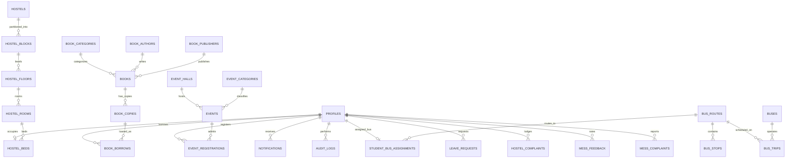

# 14. Data Architecture & Database Schema

The **Smart Campus Management System (SCMS)** is powered by a relational **PostgreSQL** database hosted on **Supabase**. The database uses UUID primary keys, declarative foreign keys with cascade/restrict rules, full-text search extensions (`pg_trgm`), automated timestamp triggers, and Row Level Security (RLS) policies.

---

## 1. Entity-Relationship Architecture

---

## 2. Table Catalog by Operational Module

### 2.1. Core System Tables
- **`public.profiles`**: Extends `auth.users` with campus attributes (`role`, `full_name`, `email`, `phone`, `roll_number`, `employee_id`, `department`, `gender`, `avatar_url`, `student_type`).
- **`public.notifications`**: User alert queue (`user_id`, `title`, `message`, `type`, `read`, `link`).
- **`public.audit_logs`**: Immutable security log (`actor_id`, `action`, `entity_type`, `entity_id`, `metadata`, `ip_address`).

### 2.2. Library Module Tables
- **`public.book_categories`**: Subject classifications (e.g. *Computer Science*, *Mathematics*).
- **`public.book_authors`**: Author biographies and names.
- **`public.book_publishers`**: Academic publishing houses.
- **`public.books`**: Bibliographic titles (`isbn`, `title`, `description`, `total_copies`, `available_copies`, `language`, `location_shelf`).
- **`public.book_copies`**: Barcoded physical inventory (`book_id`, `copy_number`, `qr_code`, `status`, `condition`, `location`).
- **`public.book_borrows`**: Circulation loans (`copy_id`, `student_id`, `borrow_date`, `due_date`, `return_date`, `renewal_count`, `fine_amount`, `fine_status`, `waived_by`).

### 2.3. Event Module Tables
- **`public.event_halls`**: Campus venue directory (`name`, `location`, `capacity`, `facilities`, `is_active`).
- **`public.event_categories`**: Category chips and colors (`name`, `color`).
- **`public.events`**: Event schedules (`title`, `description`, `category_id`, `hall_id`, `organizer_id`, `start_time`, `end_time`, `capacity`, `status`, `allow_faculty`).
- **`public.event_registrations`**: Attendee tickets (`event_id`, `user_id`, `attended`, `attended_at`, `certificate_issued`, `qr_code`).

### 2.4. Transport Module Tables
- **`public.buses`**: Fleet vehicles (`bus_number`, `capacity`, `model`, `driver_id`, `is_active`).
- **`public.bus_routes`**: Named transit routes (`name`, `description`, `is_active`).
- **`public.bus_stops`**: Ordered route waypoints (`route_id`, `name`, `stop_order`, `latitude`, `longitude`).
- **`public.student_bus_assignments`**: Bus passes for Day Scholars (`student_id`, `route_id`, `stop_id`, `valid_from`).
- **`public.bus_trips`**: Real-time trips (`bus_id`, `route_id`, `driver_id`, `trip_date`, `trip_type`, `status`, `notes`).

### 2.5. Hostel Module Tables
- **`public.hostels`**: Buildings (`name`, `type`, `warden_id`, `address`).
- **`public.hostel_blocks`**, **`hostel_floors`**, **`hostel_rooms`**: Architectural hierarchy.
- **`public.hostel_beds`**: Bed-level occupancy (`room_id`, `bed_number`, `student_id`, `status`, `allocated_at`).
- **`public.leave_requests`**: Gate-pass leaves (`student_id`, `hostel_id`, `from_date`, `to_date`, `reason`, `status`, `warden_remark`).
- **`public.hostel_attendance`**: Night roll-call logs (`student_id`, `hostel_id`, `date`, `status: present/absent/on_leave`).
- **`public.hostel_fees`**: Billing records (`student_id`, `period`, `amount`, `paid`, `paid_at`, `due_date`).
- **`public.hostel_complaints`**: Maintenance tickets (`category`, `description`, `priority`, `status`, `resolved_by`).

### 2.6. Mess Module Tables
- **`public.mess_menus`**: Daily menus (`date`, `meal_type`, `items: JSONB`).
- **`public.mess_attendance`**: Dining logs (`student_id`, `date`, `meal_type`, `present`).
- **`public.mess_feedback`**: Student satisfaction ratings (`student_id`, `date`, `meal_type`, `rating`, `comment`).
- **`public.mess_complaints`**: Catering issues (`category`, `description`, `status`, `resolved_by`).

---

## 3. Master Test Accounts Reference

The database seed script initializes representative accounts across all 8 roles:

| Role Key                | Name               | Email                       | Initial Password  |
| ----------------------- | ------------------ | --------------------------- | ----------------- |
| `super_admin`           | System Admin       | `admin@smartcampus.com`     | `Admin@12345`     |
| `hostel_warden`         | Henry Warden       | `warden@smartcampus.com`    | `Warden@12345`    |
| `mess_manager`          | Marcus Mess        | `mess@smartcampus.com`      | `Mess@12345`      |
| `librarian`             | Laura Librarian    | `librarian@smartcampus.com` | `Librarian@12345` |
| `event_organizer`       | Ethan Organizer    | `organizer@smartcampus.com` | `Organizer@12345` |
| `bus_driver`            | David Driver       | `driver@smartcampus.com`    | `Driver@12345`    |
| `faculty`               | Prof. Sarah Connor | `faculty@smartcampus.com`   | `Faculty@12345`   |
| `student` (Hosteller)   | Alex Student       | `student@smartcampus.com`   | `Student@12345`   |
| `student` (Day Scholar) | Karan Malhotra     | `student11@smartcampus.com` | `Student11@12345` |

---

> [!NOTE]
> For step-by-step verification and QA test procedures, proceed to [`15-testing-guide.md`](file:///f:/Project/SMART%20CAMPUS%20MANAGEMENT%20SYSTEM/SMART-CAMPUS-MANAGEMENT-SYSTEM/my-app/docs/15-testing-guide.md).
