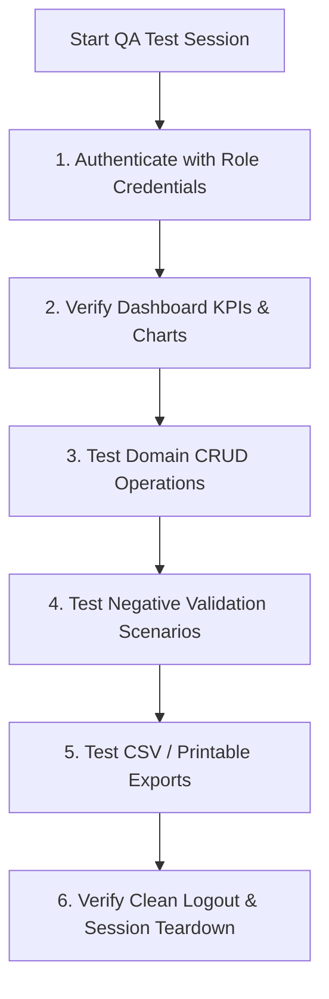

# 15. Comprehensive System Testing & QA Guide

This testing guide provides standardized test procedures for client demonstrations, user acceptance testing (UAT), and quality assurance (QA) across all 8 user roles in the **Smart Campus Management System (SCMS)**.

---

## 1. Role-by-Role Test Procedures

---

### 1.1. Super Admin Testing (`admin@smartcampus.com`)
1. **Login**: Navigate to `/login`, enter credentials, and confirm automatic redirect to `/admin/dashboard`.
2. **User Management**:
   - Navigate to `/admin/users`. Search for `"Alex Student"` and verify role badge displays `Student`.
   - Update user phone number or department. Confirm instant update.
3. **Audit Log Inspection**:
   - Navigate to `/admin/audit-logs`. Confirm recent administrative actions are logged with timestamp and actor ID.
4. **Hall Management**:
   - Navigate to `/events` ➔ **Hall Management** tab. Click **Add Hall**, enter `"Innovation Arena"`, capacity `300`, and toggle facility chips. Confirm creation.
5. **Negative Test**: Attempt to create a user with an invalid email syntax or duplicate email. Verify validation error toast appears.

---

### 1.2. Hostel Warden Testing (`warden@smartcampus.com`)
1. **Bed Allocation**:
   - Navigate to `/hostel/rooms`. Select an available bed in *"Block A, Room 101"*.
   - Allocate to an unassigned hosteller student. Verify bed status switches from `available` (Green) to `occupied` (Blue).
2. **Leave Pass Review**:
   - Navigate to `/hostel/leaves`. Locate a pending leave request.
   - Click **Approve**. Confirm state updates to `approved` and student is notified.
   - For a second request, click **Reject** without entering a remark. Verify rejection is blocked until a mandatory justification is supplied.
3. **Night Attendance**:
   - Navigate to `/hostel/attendance`. Select a room and mark all present. Verify batch update saves.
4. **CSV Export**: Click **Export Residents List**. Confirm `.csv` download triggers immediately.

---

### 1.3. Mess Manager Testing (`mess@smartcampus.com`)
1. **Weekly Menu Planning**:
   - Navigate to `/mess/menu`. Select tomorrow's date and click **Edit Breakfast**.
   - Add `"Masala Dosa, Sambar, Coconut Chutney, Filter Coffee"`. Click **Save Menu**.
   - Verify items render on the calendar grid.
2. **Feedback & Complaint Redressal**:
   - Navigate to `/mess/feedback`. Verify 1-5 star ratings and comments are listed with average calculations.
   - Navigate to `/mess/complaints`. Open an `open` ticket, update status to `resolved`, and append remarks.
3. **Negative Test**: Attempt to delete a menu for a historical date. Verify past records remain protected.

---

### 1.4. Librarian Testing (`librarian@smartcampus.com`)
1. **Cataloging & Copies**:
   - Navigate to `/library/books`. Click **Add Book**, enter title, ISBN, author, and initial copy count (e.g. 3).
   - Verify 3 unique physical copy barcodes are created automatically.
2. **Circulation Issue & Return**:
   - Navigate to `/library/borrows`. Click **Issue Book**, pick a student and an available copy. Confirm borrow record creates with due date = today + 14 days.
   - Click **Return Book** on a test loan. Verify copy status resets to `available`.
3. **Fine Waiver**:
   - Navigate to `/library/fines`. Select an overdue fine and click **Waive Fine**. Enter reason `"Medical Leave Waiver"`. Confirm fine status transitions to `WAIVED`.
4. **Negative Test**: Attempt to issue a 4th book to a student who already holds 3 active loans. Confirm system blocks loan with a clear limit alert.

---

### 1.5. Event Organizer Testing (`organizer@smartcampus.com`)
1. **Event Creation**:
   - Navigate to `/events/manage`. Click **Create Event**, select `"Main Auditorium"`, set date/time, category `"Technical"`, capacity `200`. Save and verify status is `upcoming`.
2. **Live QR Check-In**:
   - Navigate to `/events/check-in`.
   - Paste a registered student's ticket UUID into the check-in input and click **Verify**.
   - Verify green confirmation badge appears and student's `attended` flag switches to `true`.
3. **Negative Test**: Attempt to submit the same QR code a second time. Verify error alert: *"Ticket already checked in!"*.

---

### 1.6. Bus Driver Testing (`driver@smartcampus.com`)
1. **Assigned Vehicle Verification**:
   - Open `/driver/dashboard`. Verify assigned bus number and list of route stops are visible.
2. **Trip Lifecycle**:
   - Click **Start Morning Trip**. Verify trip status switches to `in_progress`.
   - Click **Complete Trip**. Verify trip status updates to `completed`.
3. **Breakdown Reporting**:
   - Click **Report Breakdown**. Enter category `"Flat Tire"` and submit. Confirm ticket appears under maintenance logs.

---

### 1.7. Hosteller Student Testing (`student@smartcampus.com`)
1. **Hostel Self-Service**:
   - Open `/hostel`. Verify assigned room number and bed number are displayed.
   - Navigate to **Leave Requests** tab. Click **Apply for Leave**, select dates and reason. Confirm status shows `pending`.
2. **Mess Menu & Feedback**:
   - Open `/mess`. Verify today's 4-meal schedule is visible.
   - Submit a 5-star rating and comment for Lunch. Confirm rating saves.
3. **Sidebar Verification**: Confirm **"My Bus"** is completely hidden from navigation.

---

### 1.8. Day Scholar Student Testing (`student11@smartcampus.com`)
1. **Transit Self-Service**:
   - Open `/bus`. Verify assigned bus number, driver phone, pickup stop, and stop order are displayed.
2. **Sidebar Verification**: Confirm **"Hostel"** and **"Mess"** are completely hidden from navigation.
3. **Library Self-Renewal**:
   - Open `/library`. View borrowed books and click **Renew** on an eligible loan. Verify due date extends by +7 days.

---

## 2. Testing Summary Checklist

| Test Suite                | Core Verification Target                            | Status |
| ------------------------- | --------------------------------------------------- | :----: |
| **Authentication & RBAC** | 8 Roles redirect to designated dashboard URLs       | ✅ PASS |
| **Edge Route Guards**     | Unauthorized direct URL navigation intercepted      | ✅ PASS |
| **Residency Segregation** | Day Scholar vs Hosteller sidebar and data isolation | ✅ PASS |
| **Library Fine Engine**   | ₹2/day computation, 3-book limit, 2-renewal cap     | ✅ PASS |
| **Event QR Terminal**     | Single-use ticket check-in and certificate issuance | ✅ PASS |
| **Double-Booking Shield** | Hall scheduling conflict detection                  | ✅ PASS |
| **Hostel Bed Constraint** | Single bed occupancy constraint per student         | ✅ PASS |

---

> [!NOTE]
> For a non-technical end-user manual for campus staff and students, proceed to [`16-client-user-guide.md`](file:///f:/Project/SMART%20CAMPUS%20MANAGEMENT%20SYSTEM/SMART-CAMPUS-MANAGEMENT-SYSTEM/my-app/docs/16-client-user-guide.md).
