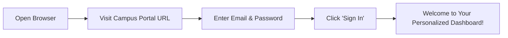

# 16. Client & End-User Operational Manual

Welcome to the **Smart Campus Management System (SCMS)** User Manual. This guide provides non-technical, step-by-step instructions to help campus staff, faculty, and students navigate the platform and perform day-to-day tasks.

---

## 1. Getting Started & Logging In

1. Open any modern web browser (Google Chrome, Microsoft Edge, Mozilla Firefox, Apple Safari).
2. Enter your campus portal address (e.g. `http://localhost:3000` or your college domain).
3. Type your registered **Campus Email** and **Password**.
4. Click the **Sign In** button. The system will automatically detect your role and take you to your personal home dashboard.

---

## 2. Navigating the Interface

- **Left Sidebar**: Your main navigation menu. It displays only the tools, services, and modules you are authorized to use.
- **Top Header**: Displays your current page title, unread notifications bell (🔔), and quick profile shortcuts.
- **User Profile Footer**: Located at the bottom of the sidebar. Shows your full name, role badge, profile link, and **Log Out** button.

---

## 3. How to Perform Common Campus Tasks

### 3.1. For Students
- **Borrowing & Renewing Library Books**:
  1. Click **Library** in the sidebar.
  2. Search for any book title or topic in the search bar.
  3. To extend a loan you already hold, find the book in your active loans list and click **Renew** (extends due date by 7 days).
- **Registering for Campus Events**:
  1. Click **Events** in the sidebar.
  2. Browse through upcoming workshops, hackathons, and cultural fests.
  3. Click **Register**. You will immediately receive a digital admission pass with a QR code.
- **Applying for a Hostel Leave Pass (Hostellers Only)**:
  1. Click **Hostel** in the sidebar and open the **Leave Requests** tab.
  2. Click **Apply for Leave**. Select your departure date, return date, and reason for travel.
  3. Click **Submit**. You will receive an alert once the Warden reviews your pass.
- **Viewing Daily Mess Food & Rating Meals (Hostellers Only)**:
  1. Click **Mess** in the sidebar to see today's breakfast, lunch, snacks, and dinner dishes.
  2. After your meal, select 1 to 5 stars and leave a comment to share your feedback with the catering team.
- **Checking Bus Timings (Day Scholars Only)**:
  1. Click **My Bus** in the sidebar.
  2. View your bus vehicle number, driver name, mobile number, pickup stop, and stop order.

---

### 3.2. For Hostel Wardens
- **Allocating a Bed to a Student**:
  1. Click **Hostel** ➔ **Rooms & Beds**.
  2. Click any **Available** bed card (marked in green).
  3. Select the student's name from the dropdown list and click **Allocate Bed**.
- **Approving or Rejecting Leave Requests**:
  1. Click **Hostel** ➔ **Leave Requests**.
  2. Review pending student applications.
  3. Click **Approve** to issue the gate pass, or click **Reject** (enter a brief explanation why).
- **Marking Night Roll-Call Attendance**:
  1. Click **Hostel** ➔ **Attendance**.
  2. Select the hostel block and room number. Check off present students and click **Save Attendance**.

---

### 3.3. For Mess Managers
- **Publishing the Weekly Menu**:
  1. Click **Mess** ➔ **Weekly Menu**.
  2. Select any day of the week (Monday through Sunday).
  3. Type the food dishes for Breakfast, Lunch, Evening Snacks, and Dinner.
  4. Click **Save Menu** to immediately publish it to resident students.
- **Reviewing Dining Feedback**:
  1. Click **Mess** ➔ **Feedback** to inspect star ratings and comments.

---

### 3.4. For Librarians
- **Adding a New Book to the Catalog**:
  1. Click **Library** ➔ **Books** ➔ **Add Book**.
  2. Enter the Title, ISBN, Author, Category, Shelf Location, and Number of Copies.
  3. Click **Create Book**. The system will generate barcodes/QR codes for each physical copy.
- **Issuing & Returning Books**:
  1. Open **Library** ➔ **Borrows**.
  2. To issue: Click **Issue Book**, choose the student and book copy, and confirm.
  3. To return: Locate the loan record and click **Return Book**. Late fees are calculated automatically.

---

### 3.5. For Event Organizers
- **Creating an Event**:
  1. Click **Events** ➔ **Create Event**.
  2. Choose a campus hall (e.g. *Main Auditorium*), set date and time, and specify capacity.
  3. Click **Publish**.
- **Checking In Attendees at the Door**:
  1. Open **Events** ➔ **QR Check-In**.
  2. Scan the attendee's mobile QR code or type their ticket code.
  3. The screen will turn green and show *"Check-In Successful"*.

---

### 3.6. For Bus Drivers
- **Running a Bus Trip**:
  1. Open your **Driver Dashboard**.
  2. Click **Start Morning Trip** when you depart the first stop.
  3. Click **Complete Trip** when you reach campus.
  4. If your bus experiences a mechanical problem, click **Report Breakdown** to notify dispatch immediately.

---

## 4. How to Export Reports & CSV Data

Administrative users (Admin, Warden, Librarian, Mess Manager, Event Organizer) can export records for offline reporting:
1. Navigate to the relevant data table (e.g. *Hostel Residents*, *Library Catalog*, *Event Attendees*).
2. Look for the **Export CSV** or **Download Report** button located at the top right of the table.
3. Click the button to immediately download the spreadsheet file to your computer.

---

> [!NOTE]
> For the complete technical end-to-end dataflow, proceed to [`17-system-workflow.md`](file:///f:/Project/SMART%20CAMPUS%20MANAGEMENT%20SYSTEM/SMART-CAMPUS-MANAGEMENT-SYSTEM/my-app/docs/17-system-workflow.md).
