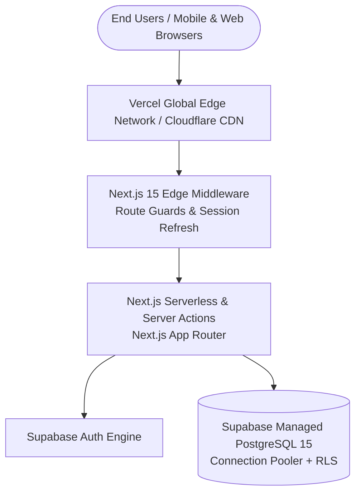

# 18. Production Deployment & Cloud Hosting Guide

This guide details the procedure for provisioning, building, and deploying the **Smart Campus Management System (SCMS)** onto cloud infrastructure using **Vercel** and **Supabase Managed Cloud**.

---

## 1. Production Architecture Overview

---

## 2. Production Environment Variables Checklist

Before initiating deployment, verify that the following variables are defined in your cloud hosting provider's project settings:

| Variable Name                   | Environment Scope        | Description                                 | Example Production Value         |
| ------------------------------- | ------------------------ | ------------------------------------------- | -------------------------------- |
| `NEXT_PUBLIC_SUPABASE_URL`      | Client & Server          | Public Supabase HTTPS endpoint              | `https://xyzproject.supabase.co` |
| `NEXT_PUBLIC_SUPABASE_ANON_KEY` | Client & Server          | Public anonymous API key                    | `eyJhbGciOi...`                  |
| `SUPABASE_SERVICE_ROLE_KEY`     | **Strictly Server-Only** | Privileged admin key for backend operations | `eyJhbGciOi...`                  |
| `NEXT_PUBLIC_APP_URL`           | Client & Server          | Fully-qualified public production domain    | `https://campus.yourcollege.edu` |
| `NEXT_PUBLIC_APP_NAME`          | Client & Server          | Institutional branding title                | `Smart Campus Management System` |

> [!CAUTION]
> Ensure `SUPABASE_SERVICE_ROLE_KEY` is never prefixed with `NEXT_PUBLIC_`, as doing so would bundle the administrative key into client JavaScript bundles.

---

## 3. Step-by-Step Vercel Deployment

1. **Repository Push**: Push your repository to GitHub, GitLab, or Bitbucket.
2. **Import into Vercel**:
   - In the **[Vercel Dashboard](https://vercel.com/dashboard)**, click **Add New...** ➔ **Project**.
   - Select your Git repository.
3. **Configure Project Settings**:
   - **Framework Preset**: `Next.js`
   - **Root Directory**: Select `my-app` (if your repository has root subdirectories).
   - **Build Command**: `npm run build`
   - **Output Directory**: `.next`
   - **Install Command**: `npm install`
4. **Define Environment Variables**:
   - Expand the **Environment Variables** section and input the 5 production keys listed above.
5. **Click Deploy**:
   - Vercel will build the Server Components, optimize assets, generate Static pages, and deploy to their global Edge network.

---

## 4. Supabase Production Configuration

1. **Authentication Redirect URLs**:
   - Open your **Supabase Project Settings** ➔ **Authentication** ➔ **URL Configuration**.
   - Set **Site URL** to your production domain: `https://campus.yourcollege.edu`.
   - Add Redirect URLs:
     - `https://campus.yourcollege.edu/login`
     - `https://campus.yourcollege.edu/reset-password`
     - `https://campus.yourcollege.edu/auth/callback`
2. **Database Pooling**:
   - For high-traffic campuses (5,000+ active students), enable the Supabase Transaction Connection Pooler (Port `6543`) to prevent database connection exhaustion during peak morning logins.
3. **Automated Backups**:
   - Verify daily Point-in-Time Recovery (PITR) is enabled under Supabase Database settings.

---

## 5. Common Deployment Troubleshooting

| Symptom / Error                       | Root Cause                                          | Remediation Procedure                                                                                                                                                                                                         |
| ------------------------------------- | --------------------------------------------------- | ----------------------------------------------------------------------------------------------------------------------------------------------------------------------------------------------------------------------------- |
| **`fetch failed / ENOTFOUND`**        | Invalid Supabase URL or paused project.             | Verify project is Active in Supabase dashboard. Confirm `NEXT_PUBLIC_SUPABASE_URL` has no typos.                                                                                                                              |
| **`Edge Middleware Execution Error`** | Node.js-only dependencies imported into middleware. | Ensure `middleware.ts` imports only lightweight edge-compatible constants ([`role-constants.ts`](file:///f:/Project/SMART%20CAMPUS%20MANAGEMENT%20SYSTEM/SMART-CAMPUS-MANAGEMENT-SYSTEM/my-app/lib/types/role-constants.ts)). |
| **Password Reset Link Fails**         | Supabase redirect URL mismatch.                     | Add production domain to Supabase Auth Allowed Redirect URLs.                                                                                                                                                                 |
| **Styles Missing / Broken UI**        | Tailored CSS purge or missing PostCSS config.       | Ensure `postcss.config.mjs` and `globals.css` are included in the build.                                                                                                                                                      |

---

## 6. Pre-Launch Go-Live Checklist

- [ ] All 3 SQL migration scripts (`001`, `004`, `005`) executed successfully on production database.
- [ ] Initial Super Admin and Staff accounts seeded and default passwords changed.
- [ ] HTTPS / SSL certificates validated on custom institutional domain.
- [ ] Password reset email delivery tested via custom SMTP server (SendGrid / AWS SES / Resend).
- [ ] Audit logging verified by creating and modifying a test record.
- [ ] Cross-browser mobile responsiveness confirmed on iOS and Android devices.

---

> [!NOTE]
> For the complete codebase directory and component architecture, proceed to [`19-project-structure.md`](file:///f:/Project/SMART%20CAMPUS%20MANAGEMENT%20SYSTEM/SMART-CAMPUS-MANAGEMENT-SYSTEM/my-app/docs/19-project-structure.md).
