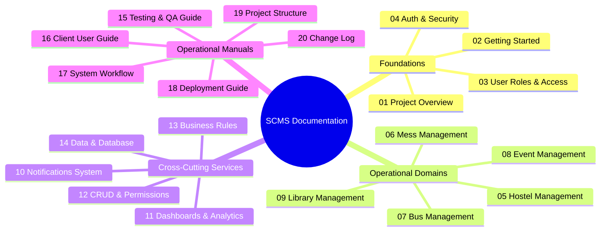

# 🏫 Smart Campus Management System — Documentation Portal

Welcome to the **Smart Campus Management System (SCMS)** documentation suite. This centralized documentation portal serves as the authoritative guide for campus leadership, system administrators, departmental staff, and deployment engineers.

---

## 🧭 Master Documentation Index

---

## 📚 Complete Document Catalog

| Index  | Document Title                                                                                                                                                 | Primary Audience               | Scope & Key Topics                                                                         |
| :----: | -------------------------------------------------------------------------------------------------------------------------------------------------------------- | ------------------------------ | ------------------------------------------------------------------------------------------ |
| **01** | [**Project Overview**](file:///f:/Project/SMART%20CAMPUS%20MANAGEMENT%20SYSTEM/SMART-CAMPUS-MANAGEMENT-SYSTEM/my-app/docs/01-project-overview.md)              | Executive Leadership / Clients | Executive summary, problems solved, core modules, technology stack justifications.         |
| **02** | [**Getting Started & Setup**](file:///f:/Project/SMART%20CAMPUS%20MANAGEMENT%20SYSTEM/SMART-CAMPUS-MANAGEMENT-SYSTEM/my-app/docs/02-getting-started.md)        | Developers / System Admins     | System requirements, npm setup, environment configuration, database seeding.               |
| **03** | [**User Roles & Access**](file:///f:/Project/SMART%20CAMPUS%20MANAGEMENT%20SYSTEM/SMART-CAMPUS-MANAGEMENT-SYSTEM/my-app/docs/03-user-roles-and-access.md)      | Admins / Auditors              | Detailed breakdown of all 8 roles, student types (Hosteller vs Day Scholar), permissions.  |
| **04** | [**Auth & Security**](file:///f:/Project/SMART%20CAMPUS%20MANAGEMENT%20SYSTEM/SMART-CAMPUS-MANAGEMENT-SYSTEM/my-app/docs/04-authentication-and-security.md)    | Security Officers / DevOps     | Login/logout mechanics, password recovery, Edge Middleware guards, Supabase RLS.           |
| **05** | [**Hostel Management**](file:///f:/Project/SMART%20CAMPUS%20MANAGEMENT%20SYSTEM/SMART-CAMPUS-MANAGEMENT-SYSTEM/my-app/docs/05-hostel-management.md)            | Hostel Wardens / Residents     | Room & bed allocation, digital leave gate-passes, night roll-call, fee tracking.           |
| **06** | [**Mess & Dining Management**](file:///f:/Project/SMART%20CAMPUS%20MANAGEMENT%20SYSTEM/SMART-CAMPUS-MANAGEMENT-SYSTEM/my-app/docs/06-mess-management.md)       | Mess Managers / Diners         | Weekly 4-meal scheduling, dining attendance, student star ratings, food grievances.        |
| **07** | [**Bus & Transport Management**](file:///f:/Project/SMART%20CAMPUS%20MANAGEMENT%20SYSTEM/SMART-CAMPUS-MANAGEMENT-SYSTEM/my-app/docs/07-bus-management.md)      | Transport Dispatch / Drivers   | Route planning, ordered stops, student pass allocation, driver trip status controls.       |
| **08** | [**Event & Venue Management**](file:///f:/Project/SMART%20CAMPUS%20MANAGEMENT%20SYSTEM/SMART-CAMPUS-MANAGEMENT-SYSTEM/my-app/docs/08-event-management.md)      | Event Organizers / Attendees   | Auditorium hall booking, double-booking shield, QR ticket check-ins, certificates.         |
| **09** | [**Library Management**](file:///f:/Project/SMART%20CAMPUS%20MANAGEMENT%20SYSTEM/SMART-CAMPUS-MANAGEMENT-SYSTEM/my-app/docs/09-library-management.md)          | Librarians / Students          | Bibliographic catalog, copy barcode inventory, borrow/renewal limits, late fines (₹2/day). |
| **10** | [**Notification System**](file:///f:/Project/SMART%20CAMPUS%20MANAGEMENT%20SYSTEM/SMART-CAMPUS-MANAGEMENT-SYSTEM/my-app/docs/10-notifications.md)              | All Campus Users               | Direct and role-broadcast notification triggers, unread badges, deep-link navigation.      |
| **11** | [**Dashboards & Analytics**](file:///f:/Project/SMART%20CAMPUS%20MANAGEMENT%20SYSTEM/SMART-CAMPUS-MANAGEMENT-SYSTEM/my-app/docs/11-dashboard-and-analytics.md) | Executive Leadership           | In-depth breakdown of all 8 role dashboards, KPI stat cards, charts, quick actions.        |
| **12** | [**CRUD & Permissions Matrix**](file:///f:/Project/SMART%20CAMPUS%20MANAGEMENT%20SYSTEM/SMART-CAMPUS-MANAGEMENT-SYSTEM/my-app/docs/12-crud-and-permissions.md) | Compliance / QA Officers       | 26-entity master table detailing Create, Read, Update, Delete, Approve, Reject & Export.   |
| **13** | [**Business Rules & Policies**](file:///f:/Project/SMART%20CAMPUS%20MANAGEMENT%20SYSTEM/SMART-CAMPUS-MANAGEMENT-SYSTEM/my-app/docs/13-business-rules.md)       | Management / Policy Leads      | Institutional policies: residency isolation, lending caps, leave rules, fee schedules.     |
| **14** | [**Data & Database Schema**](file:///f:/Project/SMART%20CAMPUS%20MANAGEMENT%20SYSTEM/SMART-CAMPUS-MANAGEMENT-SYSTEM/my-app/docs/14-data-and-database.md)       | Database Admins / Developers   | PostgreSQL table definitions, foreign keys, relationships, entity diagram, test data.      |
| **15** | [**Testing & QA Guide**](file:///f:/Project/SMART%20CAMPUS%20MANAGEMENT%20SYSTEM/SMART-CAMPUS-MANAGEMENT-SYSTEM/my-app/docs/15-testing-guide.md)               | QA Teams / Demo Conductors     | Step-by-step test cases for all 8 roles, positive & negative test scenarios.               |
| **16** | [**Client User Guide**](file:///f:/Project/SMART%20CAMPUS%20MANAGEMENT%20SYSTEM/SMART-CAMPUS-MANAGEMENT-SYSTEM/my-app/docs/16-client-user-guide.md)            | Non-Technical End Users        | Simple step-by-step user manual for students, professors, and administrative staff.        |
| **17** | [**End-to-End System Workflow**](file:///f:/Project/SMART%20CAMPUS%20MANAGEMENT%20SYSTEM/SMART-CAMPUS-MANAGEMENT-SYSTEM/my-app/docs/17-system-workflow.md)     | Systems Architects             | Complete cross-module lifecycle flow from login to approval, sync, and export.             |
| **18** | [**Deployment & Hosting Guide**](file:///f:/Project/SMART%20CAMPUS%20MANAGEMENT%20SYSTEM/SMART-CAMPUS-MANAGEMENT-SYSTEM/my-app/docs/18-deployment-guide.md)    | DevOps / Cloud Engineers       | Vercel and Supabase production deployment, custom domains, pre-launch checklist.           |
| **19** | [**Project Codebase Structure**](file:///f:/Project/SMART%20CAMPUS%20MANAGEMENT%20SYSTEM/SMART-CAMPUS-MANAGEMENT-SYSTEM/my-app/docs/19-project-structure.md)   | Software Engineers             | Source tree layout, Next.js App Router folders, Server Actions, UI components.             |
| **20** | [**Version History & Changelog**](file:///f:/Project/SMART%20CAMPUS%20MANAGEMENT%20SYSTEM/SMART-CAMPUS-MANAGEMENT-SYSTEM/my-app/docs/20-change-log.md)         | Product Managers / Clients     | Release notes for v1.0.0 Enterprise Release and planned roadmap items.                     |

---

## 🔑 Master Test Credentials Reference

For client demonstrations and feature evaluation, log in using these seeded role accounts:

| Role Title                | User Name          | Login Email                 | Password          | Landing Route                |
| ------------------------- | ------------------ | --------------------------- | ----------------- | ---------------------------- |
| **Super Admin**           | System Admin       | `admin@smartcampus.com`     | `Admin@12345`     | `/admin/dashboard`           |
| **Hostel Warden**         | Henry Warden       | `warden@smartcampus.com`    | `Warden@12345`    | `/warden/dashboard`          |
| **Mess Manager**          | Marcus Mess        | `mess@smartcampus.com`      | `Mess@12345`      | `/mess-manager/dashboard`    |
| **Librarian**             | Laura Librarian    | `librarian@smartcampus.com` | `Librarian@12345` | `/librarian/dashboard`       |
| **Event Organizer**       | Ethan Organizer    | `organizer@smartcampus.com` | `Organizer@12345` | `/event-organizer/dashboard` |
| **Bus Driver**            | David Driver       | `driver@smartcampus.com`    | `Driver@12345`    | `/driver/dashboard`          |
| **Faculty Member**        | Prof. Sarah Connor | `faculty@smartcampus.com`   | `Faculty@12345`   | `/faculty/dashboard`         |
| **Student (Hosteller)**   | Alex Student       | `student@smartcampus.com`   | `Student@12345`   | `/dashboard`                 |
| **Student (Day Scholar)** | Karan Malhotra     | `student11@smartcampus.com` | `Student11@12345` | `/dashboard`                 |

---

## 💡 Recommended Reading Paths

- **For Prospective Clients & Evaluators**: Start with [01. Project Overview](file:///f:/Project/SMART%20CAMPUS%20MANAGEMENT%20SYSTEM/SMART-CAMPUS-MANAGEMENT-SYSTEM/my-app/docs/01-project-overview.md), [11. Dashboards & Analytics](file:///f:/Project/SMART%20CAMPUS%20MANAGEMENT%20SYSTEM/SMART-CAMPUS-MANAGEMENT-SYSTEM/my-app/docs/11-dashboard-and-analytics.md), and [16. Client User Guide](file:///f:/Project/SMART%20CAMPUS%20MANAGEMENT%20SYSTEM/SMART-CAMPUS-MANAGEMENT-SYSTEM/my-app/docs/16-client-user-guide.md).
- **For Campus Administrators & Wardens**: Read [03. User Roles & Access](file:///f:/Project/SMART%20CAMPUS%20MANAGEMENT%20SYSTEM/SMART-CAMPUS-MANAGEMENT-SYSTEM/my-app/docs/03-user-roles-and-access.md), [05. Hostel Management](file:///f:/Project/SMART%20CAMPUS%20MANAGEMENT%20SYSTEM/SMART-CAMPUS-MANAGEMENT-SYSTEM/my-app/docs/05-hostel-management.md), and [13. Business Rules](file:///f:/Project/SMART%20CAMPUS%20MANAGEMENT%20SYSTEM/SMART-CAMPUS-MANAGEMENT-SYSTEM/my-app/docs/13-business-rules.md).
- **For Technical Teams & DevOps**: Read [02. Getting Started](file:///f:/Project/SMART%20CAMPUS%20MANAGEMENT%20SYSTEM/SMART-CAMPUS-MANAGEMENT-SYSTEM/my-app/docs/02-getting-started.md), [14. Data & Database Schema](file:///f:/Project/SMART%20CAMPUS%20MANAGEMENT%20SYSTEM/SMART-CAMPUS-MANAGEMENT-SYSTEM/my-app/docs/14-data-and-database.md), [18. Deployment Guide](file:///f:/Project/SMART%20CAMPUS%20MANAGEMENT%20SYSTEM/SMART-CAMPUS-MANAGEMENT-SYSTEM/my-app/docs/18-deployment-guide.md), and [19. Project Structure](file:///f:/Project/SMART%20CAMPUS%20MANAGEMENT%20SYSTEM/SMART-CAMPUS-MANAGEMENT-SYSTEM/my-app/docs/19-project-structure.md).
